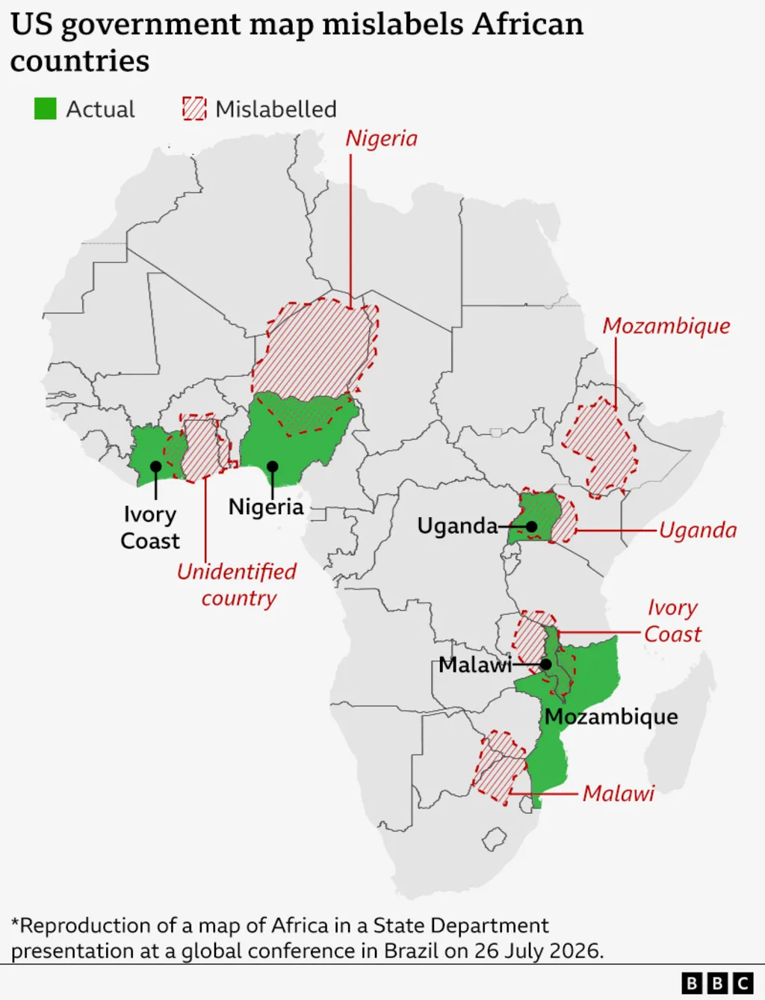






# 

<br>

[]{.large}

September 15, 2026

---





<br>
{fig-align="center" width=100%}

---





# Handwriting practice sheets

<center>

</center>

---




# Prompt:

## *"Make a one-page handwriting practice sheet<br>with sentences about **pokemon**"*

---



{fig-align="center" height="800"}

---





# Eight rounds later...

---



{fig-align="center" height="800"}

---



# I want [**these**]{.contentchip} sentences with [**this**]{.formatchip} layout

::: {.col .amberborder}
{fig-align="center" height="600"}
:::

::: {.col .blueborder}
{fig-align="center" height="600"}
:::

---




<!--
  ENTANGLEMENT FIGURE, SLIDE 1 OF 2 — "ask for the document."

  Its job here is GENERALIZATION, not explanation: the handwriting sheet already
  taught the idea, so this only has to show the same shape without pokemon in it.

  The claim: the weaving happens inside one probabilistic pass, so the only lever
  you have on the content is to re-prompt and take another draw.

  BUILD. At rest, one loop, ALREADY in the top third at its final y=175 —
  nothing slides. Click 1: run 2 arrives under it. Click 2: run 3.
  Rows sit 186 apart, which is 70 units of clear air between one artifact and
  the next (it was 56, and the connector labels were visibly cramped).
  The three loops are byte-identical to each other — literally one <use> of
  #loop — so the only thing that differs down the column is the document that
  falls out the end. That is the whole argument, and it has to be legible from
  the back of the room, which is why the three documents differ in MOTIF
  (dots / blocks / bands) and not merely in band heights.

  ORDER IS NOT ARBITRARY. Row 3 is the draw you kept — it carries the green
  check, and it is the BANDS, which is the only motif that reads as lines of
  text on a page. It is also #docOut on the next slide, so slide 2 opens on the
  document this slide just checked. The two scattered motifs (dots, blocks) are
  the drafts you threw away, and they go first because at distance they read as
  "that came out wrong."

  The artifact is a PAGE with a folded corner, labelled `.pdf` — the thing it
  actually stands for, and the same portrait sheet the payoff slide shows for
  real. See the note on #doc for why it isn't an oval any more.

  The connectors matter: run 2 is not an edit of run 1, it is another full pass
  reached only by re-prompting. Nothing points from one document to the next.

  NO LEGEND, on purpose. The two previous slides teach the color vocabulary —
  one concretely (this layout / these sentences), one by naming it — so all this
  slide needs is the closing sentence from that second slide, carried across the
  top in the same two colors. A swatch legend said the same thing in 17px type
  nobody could read from the back.

  That sentence is the lexis heading ABOVE this block, not SVG text, so its two
  words are the same `.contentchip` / `.formatchip` the previous slides taught —
  the same object, not merely the same hue. Consequence: the viewBox starts at
  y=77 rather than 0, cropping the space the old <text> occupied. Coordinates
  inside are unchanged; don't renumber them.

  BOTH FIGURE SLIDES NOW SHARE ONE viewBox — "0 77 1240 553" — which is what
  registers them: same box, same row y (175), so the at-rest picture lands on
  the identical pixels and advancing to slide 2 changes nothing until you
  click. Slide 2 has ~280 units of dead canvas under its figure as the price.
  Change one viewBox and you must change the other.

  Everything else that used to be labelled is now spoken: no "ASK FOR THE
  DOCUMENT" (the sentence above says it), no run 1/2/3 (the stack says it), no
  summary caption (three different documents off one identical loop IS the
  caption).

  Colors are the deck's vocabulary and never change: yellow = content/data,
  teal = structure/format, purple = the human's direct action.

  NOTE: #doc (row 3, the kept one) is duplicated as #docOut in slide 2's <defs>
  and #docDots (row 1) as #docDotsOut; each pair must stay byte-identical. They
  are NOT shared via one <use> across slides on purpose: reveal puts non-current
  slides in display:none, and cross-slide <use> resolution is unreliable there.
-->

# [Content]{.contentchip} entangled with [Format]{.formatchip}

```{=html}
<svg viewBox="0 77 1240 553" width="100%" style="max-height:80vh;"
     xmlns="http://www.w3.org/2000/svg"
     font-family="'Fira Sans Condensed', Tahoma, sans-serif">

  <defs>
    <!-- The page every artifact in this figure is cut to. userSpaceOnUse
         (the default) resolves in the <use>d group's own local space, so
         one clip serves every motif. -->
    <clipPath id="artifactClip">
      <path d="M 0 0 L 68 0 L 90 22 L 90 116 L 0 116 Z"/>
    </clipPath>

    <!-- THE ARTIFACT. A PAGE — 90 x 116, US Letter proportions, with a folded
         corner. It is the thing it stands for: the rendered handwriting sheet
         from Act 1, and the same portrait sheet the payoff slide puts on screen
         two slides later. The dog-ear is the universal document glyph, so the
         shape reads instantly from the back of the room with no label doing the
         work.

         It is deliberately NOT a rounded rect — that is the actor shape (`me`,
         the agent). It IS the same rect family as the .qmd on the next slide,
         and that is the point: same two colours, same kind of box, and the ONLY
         thing that differs is whether the bands have places. That single
         variable is the address argument. (This replaced an oval, whose
         "no corners, nothing to index" logic only ever resolved for whoever
         drew it; at distance it read as a blob, and it disagreed with the real
         sheets on the payoff slide.)

         Teal and yellow interleaved, irregular, bleeding edge to edge and
         clipped to the page: content and format fused. Never drawn as a box
         inside a box — containment would imply they are already separate,
         which is the visual opposite of entanglement. Horizontal bands, not
         vertical stripes: on a page, horizontal reads as lines of a document,
         and it makes the comparison with the .qmd's two stacked bands direct.

         Band heights are slide-1's old stripe widths scaled 200 -> 116, so the
         weave has the same rhythm it always had. 90 x 116 in PARENT units,
         drawn 1:1 — no scale() on the <use>. Height is UNCHANGED from the oval
         (116), so the row spacing and the whole height budget are untouched;
         only the width came down, 200 -> 90.

         The `.pdf` label is the one piece of text inside a repeated unit, and
         it is worth the 3x: it makes slide 2 read `.qmd` -[render]- `.pdf`,
         which is the entire explanation of what Quarto is for anyone watching
         the recording who doesn't already know. It also removes any question
         about which rect is which once the .qmd arrives. -->
    <g id="doc">
      <text x="45" y="-12" font-size="22" text-anchor="middle"
            fill="#2e4057" font-family="SFMono-Regular, Menlo, monospace">.pdf</text>
      <g clip-path="url(#artifactClip)">
        <rect x="0" y="0"   width="90" height="9"  fill="#00798c"/>
        <rect x="0" y="9"   width="90" height="13" fill="#edae49"/>
        <rect x="0" y="22"  width="90" height="7"  fill="#00798c"/>
        <rect x="0" y="29"  width="90" height="16" fill="#edae49"/>
        <rect x="0" y="45"  width="90" height="10" fill="#00798c"/>
        <rect x="0" y="55"  width="90" height="7"  fill="#edae49"/>
        <rect x="0" y="62"  width="90" height="13" fill="#00798c"/>
        <rect x="0" y="75"  width="90" height="12" fill="#edae49"/>
        <rect x="0" y="87"  width="90" height="6"  fill="#00798c"/>
        <rect x="0" y="93"  width="90" height="13" fill="#edae49"/>
        <rect x="0" y="106" width="90" height="10" fill="#00798c"/>
      </g>
      <path d="M 0 0 L 68 0 L 90 22 L 90 116 L 0 116 Z" fill="none"
            stroke="#2e4057" stroke-width="2.5"/>
      <path d="M 68 0 L 90 22 L 68 22 Z" fill="#FFFFFF"
            stroke="#2e4057" stroke-width="2.5"/>
    </g>

    <!-- Runs 2 and 3: same prompt, different draw. Same page, same two colors,
         a completely different weave. The motif changes (bands -> dots ->
         blocks) rather than just the proportions, because from row 10 a
         re-shuffled band pattern reads as "the same picture again."

         Both content AND format are redrawn on every pass, and that is
         deliberate: the cold open is pokemon sentences drifting into minecraft
         sentences, so holding the yellow fixed would claim the content
         survived the re-prompt. It didn't.

         Dots and blocks are placed, not clipped: every one is verified to sit
         wholly inside the page and clear of the folded corner (x >= 68 and
         y <= 22), so nothing is sliced at an edge. r=10 and side 14-18 keep
         them the physical size they had before the page narrowed; three
         columns instead of seven, four rows instead of three. -->
    <g id="docDots">
      <text x="45" y="-12" font-size="22" text-anchor="middle"
            fill="#2e4057" font-family="SFMono-Regular, Menlo, monospace">.pdf</text>
      <path d="M 0 0 L 68 0 L 90 22 L 90 116 L 0 116 Z" fill="#FFFFFF"/>
      <circle cx="22" cy="20" r="10" fill="#00798c"/>
      <circle cx="45" cy="20" r="10" fill="#edae49"/>
      <circle cx="22" cy="44" r="10" fill="#edae49"/>
      <circle cx="45" cy="44" r="10" fill="#edae49"/>
      <circle cx="68" cy="44" r="10" fill="#00798c"/>
      <circle cx="22" cy="68" r="10" fill="#edae49"/>
      <circle cx="45" cy="68" r="10" fill="#00798c"/>
      <circle cx="68" cy="68" r="10" fill="#edae49"/>
      <circle cx="22" cy="92" r="10" fill="#00798c"/>
      <circle cx="45" cy="92" r="10" fill="#edae49"/>
      <circle cx="68" cy="92" r="10" fill="#00798c"/>
      <path d="M 0 0 L 68 0 L 90 22 L 90 116 L 0 116 Z" fill="none"
            stroke="#2e4057" stroke-width="2.5"/>
      <path d="M 68 0 L 90 22 L 68 22 Z" fill="#FFFFFF"
            stroke="#2e4057" stroke-width="2.5"/>
    </g>

    <g id="docBlocks">
      <text x="45" y="-12" font-size="22" text-anchor="middle"
            fill="#2e4057" font-family="SFMono-Regular, Menlo, monospace">.pdf</text>
      <path d="M 0 0 L 68 0 L 90 22 L 90 116 L 0 116 Z" fill="#FFFFFF"/>
      <rect x="14" y="12" width="16" height="16" fill="#edae49"/>
      <rect x="38" y="13" width="14" height="14" fill="#00798c"/>
      <rect x="13" y="35" width="18" height="18" fill="#edae49"/>
      <rect x="38" y="37" width="14" height="14" fill="#00798c"/>
      <rect x="60" y="36" width="16" height="16" fill="#edae49"/>
      <rect x="15" y="61" width="14" height="14" fill="#00798c"/>
      <rect x="36" y="59" width="18" height="18" fill="#edae49"/>
      <rect x="60" y="60" width="16" height="16" fill="#edae49"/>
      <rect x="14" y="84" width="16" height="16" fill="#00798c"/>
      <rect x="38" y="85" width="14" height="14" fill="#edae49"/>
      <rect x="59" y="83" width="18" height="18" fill="#00798c"/>
      <path d="M 0 0 L 68 0 L 90 22 L 90 116 L 0 116 Z" fill="none"
            stroke="#2e4057" stroke-width="2.5"/>
      <path d="M 68 0 L 90 22 L 68 22 Z" fill="#FFFFFF"
            stroke="#2e4057" stroke-width="2.5"/>
    </g>

    <!-- THE LOOP, drawn once and <use>d three times so the rows are provably
         identical. Local coords: the row's centerline is y = 0. -->
    <!-- The row is centred in the 1240-wide box: me 340 .. artifact 900 is 560
         wide, so 340 units of margin either side. (It was 285 when the artifact
         was 200 wide; the page is 110 narrower, so the whole chain moved 55
         right to stay centred. Nothing else about the row changed.) Both arrows
         are identical — same weight, same 80-unit run, same 8-unit landing gap
         — because they are the same kind of step. 80 is also what slide 2 uses
         either side of the .qmd, so every arrow in the figure is one length. -->
    <g id="loop">
      <rect x="340" y="-32" width="110" height="64" rx="6"
            fill="#FFFFFF" stroke="#2e4057" stroke-width="2.5"/>
      <text x="395" y="9" font-size="24" text-anchor="middle" fill="#2e4057">me</text>

      <path d="M 452 0 L 532 0" stroke="#2e4057" stroke-width="2.5"
            marker-end="url(#ahDark)"/>

      <!-- agent. dashed = the stochastic component. Same box in both slides:
           the agent is not what changes between them. -->
      <rect x="540" y="-32" width="180" height="64" rx="6"
            fill="#FFFFFF" stroke="#2e4057" stroke-width="2.5"
            stroke-dasharray="7 5"/>
      <text x="630" y="9" font-size="24" text-anchor="middle" fill="#2e4057">LLM agent</text>

      <!-- One jump, no intermediate, and deliberately unlabelled: the row
           repeats three times, so any text here repeats three times too. The
           emptiness under this arrow is exactly the space Quarto fills on the
           next slide — say "one probabilistic pass" out loud instead. -->
      <path d="M 722 0 L 802 0" stroke="#2e4057" stroke-width="2.5"
            marker-end="url(#ahDark)"/>
    </g>

    <!-- refX=5.5, not 7 (the tip). markerUnits defaults to strokeWidth, so the
         head scales with the line; parking the tip exactly on the path end
         leaves the line's blunt butt-cap poking out through the taper, because
         near the point the triangle is narrower than the stroke is thick.
         Backing refX off by 1.5 marker units pushes the head forward far enough
         that the stroke ends where the triangle is already wider than it —
         covered — while the visible tip lands 1.5x stroke-width past the path
         end. Path ends are set with that overhang subtracted. -->
    <marker id="ahDark" markerWidth="9" markerHeight="9" refX="5.5" refY="3"
            orient="auto"><path d="M0,0 L7,3 L0,6 z" fill="#2e4057"/></marker>
    <marker id="ahGray" markerWidth="9" markerHeight="9" refX="5.5" refY="3"
            orient="auto"><path d="M0,0 L7,3 L0,6 z" fill="#606771"/></marker>
  </defs>

  <!-- RUN 1. Static, and it sits in its final place from the moment the slide
       appears — no reveal class, no transform trigger. It used to be
       `fragment custom lift`: parked low so it read as centred on its own, then
       released up on click 1 to make room for run 2. Cut because nothing on
       screen should move that isn't part of the argument, and a row sliding up
       is a motion the audience has to parse before the point lands. Rows 2 and
       3 now simply arrive underneath it.

       Rows are 186 apart (was 165), giving 70 units of clear air between one
       artifact and the next, against 56 before. The page is 116 tall, exactly
       what the oval was, so none of this arithmetic moved when the shape
       changed — only the width did.

       The artifact sits at x=810 (was 755): the page is 110 narrower than the
       oval, so the chain shifted 55 right and its centre stayed put. Its centre
       is still x=855, which is why the connectors below need no new x. -->
  <g transform="translate(0 175)">
    <use href="#loop"/>
    <g transform="translate(810 -58)"><use href="#docDots"/></g>
  </g>

  <!-- RUN 2. The connector is the only route from one row to the next, and it
       lands on `me` — not on the document. You don't get to touch run 1; you
       get to ask again. -->
  <g class="fragment" data-fragment-index="1">
    <path d="M 855 236 L 855 248 Q 855 260 841 260 L 409 260 Q 395 260 395 272 L 395 322"
          fill="none" stroke="#606771" stroke-width="2.5"
          stroke-dasharray="7 5" marker-end="url(#ahGray)"/>
    <text x="625" y="282" font-size="22" fill="#606771"
          text-anchor="middle">review &amp; re-prompt</text>
    <g transform="translate(0 361)">
      <use href="#loop"/>
      <g transform="translate(810 -58)"><use href="#docBlocks"/></g>
    </g>
  </g>

  <!-- RUN 3. -->
  <g class="fragment" data-fragment-index="2">
    <path d="M 855 422 L 855 434 Q 855 446 841 446 L 409 446 Q 395 446 395 458 L 395 508"
          fill="none" stroke="#606771" stroke-width="2.5"
          stroke-dasharray="7 5" marker-end="url(#ahGray)"/>
    <text x="625" y="468" font-size="22" fill="#606771"
          text-anchor="middle">review &amp; re-prompt</text>
    <g transform="translate(0 547)">
      <use href="#loop"/>
      <g transform="translate(810 -58)"><use href="#doc"/></g>
      <!-- THE ONE WE KEPT. Drawn on row 3 only, so it is deliberately NOT in
           #loop — the rows stay provably identical and this sits beside the
           last page rather than inside it. Green (#66a182, minou) is not used
           anywhere else, so it reads as a verdict on the artifact and can't be
           mistaken for content (yellow) or format (teal). It rides run 3's
           fragment: no extra click, no motion after the page lands. -->
      <path d="M 925 4 L 941 20 L 971 -26" fill="none" stroke="#66a182"
            stroke-width="9" stroke-linecap="round" stroke-linejoin="round"/>
    </g>
  </g>

</svg>
```

::: {.notes}
Generalize what they just watched — don't re-explain it.

Same two things, same two colors. By the time I see the document they're fused —
one probabilistic pass wove them together, right there in the middle. Note the
dashed box: that step is a draw, not a computation.

Click 1. Same prompt, same model, same loop — line it up, it's the identical
picture — and look what comes out the end. Click 2. Again.

And notice what the arrow connects to. It never reaches the document above it.
It goes back to me. The second one isn't an edit of the first — the first is
thrown away and the whole thing is rewoven from scratch. Eight rounds of that is
how I lost the pokemon sentences.

So when a sentence is wrong, there's nothing to reach into. All I can do is
review, ask again, and take another draw.
:::

---




<!--
  ENTANGLEMENT FIGURE, SLIDE 2 OF 2 — "ask for the source."

  Deliberately the SAME left-hand composition as slide 1 (me -> agent, same
  boxes, same positions) so the pair reads as one picture with one thing
  changed. What changed is the middle: the agent now writes structure, the
  content sits beside it, and the weave happens at render.

  At rest the output is slide 1's ROW 1 — the first draft, dots — so the pair
  starts from the same picture. On click 1 it becomes ROW 3, the page carrying
  the green check: the document that took eight rounds to reach the last time.
  The argument is still NOT "the .qmd is prettier"; it's that the weaving moved
  somewhere you can reach, and that reaching it took one step instead of eight.
  Keep each <defs> copy identical to its twin on slide 1.

  The heading is the lexis line ABOVE this block, matching slide 1 — same
  sentence with two words inserted, same chips. The viewBox is IDENTICAL to
  slide 1's ("0 77 1240 553") and so is the row's y (175): that is the whole
  registration mechanism, and it costs ~280 units of dead canvas below this
  figure. Coordinates inside are otherwise unchanged.
-->

<!-- The Content chip turns red on click 3, with the content block inside the
     figure. It is a `fragment custom` colour toggle, not a second heading:
     reveal leaves it visible at rest and only adds `.visible`, and custom.css
     does the rest. Stacking two headings and cross-fading them would have
     reserved space for both (reveal hides fragments with visibility:hidden,
     which still occupies layout), and moving the heading back inside the SVG
     would cost the chips. -->

# Quarto disentangles [Content]{.contentchip .fragment .custom .turnsred data-fragment-index="3"} and [Format]{.formatchip}

```{=html}
<!-- margin-top drops the whole box 50px so the drawn figure sits centred rather
     than riding the heading: this slide's content only fills the top ~275 of a
     553-unit viewBox (the rest is the dead canvas registration costs), so the
     SVG's own centre is well below its ink. This is the ONE thing slide 2 does
     that slide 1 doesn't, so the at-rest pictures now differ by exactly these
     50px — remove it, or add the same to slide 1, if the stillness matters more
     than the centring. -->
<svg viewBox="0 77 1240 553" width="100%" style="max-height:80vh; margin-top:50px;"
     xmlns="http://www.w3.org/2000/svg"
     font-family="'Fira Sans Condensed', Tahoma, sans-serif">

  <defs>
    <!-- The page every artifact in this figure is cut to. userSpaceOnUse
         (the default) resolves in the <use>d group's own local space, so
         one clip serves every motif. -->
    <clipPath id="artifactClip2">
      <path d="M 0 0 L 68 0 L 90 22 L 90 116 L 0 116 Z"/>
    </clipPath>

    <!-- AT REST: byte-identical to #docDots — slide 1's ROW 1, the first draw.
         This is what keeps the two slides registered: same viewBox, same row y,
         same document, so advancing changes nothing until you click.
         It uses no clipPath (every dot is placed inside the page), so the copy
         is #docDots with the id renamed and nothing else. Edit one, edit both. -->
    <g id="docDotsOut">
      <text x="45" y="-12" font-size="22" text-anchor="middle"
            fill="#2e4057" font-family="SFMono-Regular, Menlo, monospace">.pdf</text>
      <path d="M 0 0 L 68 0 L 90 22 L 90 116 L 0 116 Z" fill="#FFFFFF"/>
      <circle cx="22" cy="20" r="10" fill="#00798c"/>
      <circle cx="45" cy="20" r="10" fill="#edae49"/>
      <circle cx="22" cy="44" r="10" fill="#edae49"/>
      <circle cx="45" cy="44" r="10" fill="#edae49"/>
      <circle cx="68" cy="44" r="10" fill="#00798c"/>
      <circle cx="22" cy="68" r="10" fill="#edae49"/>
      <circle cx="45" cy="68" r="10" fill="#00798c"/>
      <circle cx="68" cy="68" r="10" fill="#edae49"/>
      <circle cx="22" cy="92" r="10" fill="#00798c"/>
      <circle cx="45" cy="92" r="10" fill="#edae49"/>
      <circle cx="68" cy="92" r="10" fill="#00798c"/>
      <path d="M 0 0 L 68 0 L 90 22 L 90 116 L 0 116 Z" fill="none"
            stroke="#2e4057" stroke-width="2.5"/>
      <path d="M 68 0 L 90 22 L 68 22 Z" fill="#FFFFFF"
            stroke="#2e4057" stroke-width="2.5"/>
    </g>

    <!-- Byte-identical to #doc on the previous slide — ROW 3, the draw that
         carries the green check. This is the document you actually wanted, and
         it is what the .qmd renders to from click 1 on. If you edit one, edit
         both.

         The `.pdf` label earns its keep here: with the .qmd on screen the row
         reads `.qmd` -[render]- `.pdf`, which is the whole of what Quarto does,
         stated without a slide spent on it. It also makes the two rects
         unmistakable — one is the source, one is the output. -->
    <g id="docOut">
      <text x="45" y="-12" font-size="22" text-anchor="middle"
            fill="#2e4057" font-family="SFMono-Regular, Menlo, monospace">.pdf</text>
      <g clip-path="url(#artifactClip2)">
        <rect x="0" y="0"   width="90" height="9"  fill="#00798c"/>
        <rect x="0" y="9"   width="90" height="13" fill="#edae49"/>
        <rect x="0" y="22"  width="90" height="7"  fill="#00798c"/>
        <rect x="0" y="29"  width="90" height="16" fill="#edae49"/>
        <rect x="0" y="45"  width="90" height="10" fill="#00798c"/>
        <rect x="0" y="55"  width="90" height="7"  fill="#edae49"/>
        <rect x="0" y="62"  width="90" height="13" fill="#00798c"/>
        <rect x="0" y="75"  width="90" height="12" fill="#edae49"/>
        <rect x="0" y="87"  width="90" height="6"  fill="#00798c"/>
        <rect x="0" y="93"  width="90" height="13" fill="#edae49"/>
        <rect x="0" y="106" width="90" height="10" fill="#00798c"/>
      </g>
      <path d="M 0 0 L 68 0 L 90 22 L 90 116 L 0 116 Z" fill="none"
            stroke="#2e4057" stroke-width="2.5"/>
      <path d="M 68 0 L 90 22 L 68 22 Z" fill="#FFFFFF"
            stroke="#2e4057" stroke-width="2.5"/>
    </g>

    <!-- Byte-identical to #docOut except every yellow band is red. Same rects,
         same heights, same order — if you touch one, touch both, or the click
         stops meaning "only the content changed". -->
    <g id="docOutEdited">
      <text x="45" y="-12" font-size="22" text-anchor="middle"
            fill="#2e4057" font-family="SFMono-Regular, Menlo, monospace">.pdf</text>
      <g clip-path="url(#artifactClip2)">
        <rect x="0" y="0"   width="90" height="9"  fill="#00798c"/>
        <rect x="0" y="9"   width="90" height="13" fill="#d1495b"/>
        <rect x="0" y="22"  width="90" height="7"  fill="#00798c"/>
        <rect x="0" y="29"  width="90" height="16" fill="#d1495b"/>
        <rect x="0" y="45"  width="90" height="10" fill="#00798c"/>
        <rect x="0" y="55"  width="90" height="7"  fill="#d1495b"/>
        <rect x="0" y="62"  width="90" height="13" fill="#00798c"/>
        <rect x="0" y="75"  width="90" height="12" fill="#d1495b"/>
        <rect x="0" y="87"  width="90" height="6"  fill="#00798c"/>
        <rect x="0" y="93"  width="90" height="13" fill="#d1495b"/>
        <rect x="0" y="106" width="90" height="10" fill="#00798c"/>
      </g>
      <path d="M 0 0 L 68 0 L 90 22 L 90 116 L 0 116 Z" fill="none"
            stroke="#2e4057" stroke-width="2.5"/>
      <path d="M 68 0 L 90 22 L 68 22 Z" fill="#FFFFFF"
            stroke="#2e4057" stroke-width="2.5"/>
    </g>

    <!-- refX=5.5 for the same reason as slide 1's markers: at 7 the tip sits on
         the path end and the stroke poked out through the taper. -->
    <marker id="ahDark2" markerWidth="9" markerHeight="9" refX="5.5" refY="3"
            orient="auto"><path d="M0,0 L7,3 L0,6 z" fill="#2e4057"/></marker>
    <!-- The edit arrow's head. Purple #852f88 (ltc "hat"), the deck's one
         accent: see the note on the arrow itself for why it isn't green. -->
    <marker id="ahEdit2" markerWidth="9" markerHeight="9" refX="5.5" refY="3"
            orient="auto"><path d="M0,0 L7,3 L0,6 z" fill="#852f88"/></marker>
  </defs>
  <!-- ── AT REST: the picture from slide 1, unchanged ────────────────────
       me -> agent -> document, at slide 1's own coordinates (me x=340,
       agent x=540, document x=810, row centred on y=175), at the same box
       sizes and the same 80-unit arrows. The viewBox is identical to slide 1's
       so this lands at the SAME SCREEN POSITION as slide 1's row 1, and
       arriving on this slide changes nothing at all until you click. That
       stillness is the setup: same me, same agent, same document.

       No "prompt once" label any more — at rest this slide must not claim
       anything slide 1 didn't.

       CLICK 1 opens the chain and drops the .qmd into the gap: me+agent glide
       140 units left, the artifact glides 140 right (symmetric, so the row
       stays centred), and the source file fades in between them. Every arrow
       in the figure is 80 units now, here included. Both shifts are CSS transforms on
       `fragment custom` groups — reveal's `:not(.custom)` rule leaves them
       visible at rest and only toggles `.visible`. If that CSS is ever lost
       the boxes simply stay put and the .qmd lands on top of the document,
       so the two rules in custom.css are NOT optional here (unlike the old
       lift on slide 1, which degraded safely). -->

  <g class="fragment custom openleft" data-fragment-index="1">
    <rect x="340" y="143" width="110" height="64" rx="6"
          fill="#FFFFFF" stroke="#2e4057" stroke-width="2.5"/>
    <text x="395" y="184" font-size="24" text-anchor="middle" fill="#2e4057">me</text>
    <path d="M 452 175 L 532 175" stroke="#2e4057" stroke-width="2.5"
          marker-end="url(#ahDark2)"/>

    <!-- agent. STILL dashed — still probabilistic. That's the honest part: the
         agent didn't get better, the thing it writes did. -->
    <rect x="540" y="143" width="180" height="64" rx="6"
          fill="#FFFFFF" stroke="#2e4057" stroke-width="2.5"
          stroke-dasharray="7 5"/>
    <text x="630" y="184" font-size="24" text-anchor="middle" fill="#2e4057">LLM agent</text>

    <!-- The direct agent -> document arrow: the whole of slide 1's claim in one
         line. It rides along with the agent as the chain opens and fades out
         as the .qmd takes its place. Nested inside this group on purpose, so
         it stays attached to the agent while it goes. -->
    <g class="fragment fade-out" data-fragment-index="1">
      <path d="M 722 175 L 802 175" stroke="#2e4057" stroke-width="2.5"
            marker-end="url(#ahDark2)"/>
    </g>
  </g>

  <!-- The artifact. At rest byte-identical to run 1 on slide 1, same page, same
       1:1 size; from click 1 it is run 3's page, the checked one. Either way
       it is entangled — a PDF is a PDF. Same two colours as the .qmd box —
       but here they interleave with no boundary, and there they each have a
       place. That contrast IS the address argument, so keep both on screen
       together, and it is now a clean comparison: two rects of the same family,
       one whose bands have places and one whose bands don't. Labels finish the
       job — `.qmd` on the source, `.pdf` on the output.

       CLICK 3 paints #docOutEdited over it: the same page with the yellow
       bands turned red. The teal bands are byte-identical and do NOT move —
       you changed the content, so only the content changed. Every stripe stayed
       exactly where it was, which is the thing a regenerated document can never
       promise. It is an overlay rather than a swap because the two have
       identical geometry, so the red simply covers the yellow. -->
  <g class="fragment custom openright" data-fragment-index="1">
    <!-- At rest: slide 1's row 1, the first draw. Fades out on click 1, when the
         route it came from (agent -> document) fades out with it. -->
    <g class="fragment fade-out" data-fragment-index="1">
      <g transform="translate(810 117)"><use href="#docDotsOut"/></g>
    </g>
    <!-- Click 1: the document you kept — row 3's page, the one with the check.
         Painted OVER the dots, which it fully covers (the eleven bands total
         exactly 116 and the fold is repainted white), so this is an overlay like
         the click-3 recolour, not a swap. The swap rides click 1 and not click 3
         on purpose: what changes here is the ROUTE (the agent now writes source),
         so a different document coming out is honest. Move it to
         data-fragment-index="3" if you'd rather the edit itself be what produces
         the kept document — one attribute, and click 3 then changes the whole
         page instead of only its content. -->
    <g class="fragment" data-fragment-index="1">
      <g transform="translate(810 117)"><use href="#docOut"/></g>
    </g>
    <g class="fragment" data-fragment-index="3">
      <g transform="translate(810 117)"><use href="#docOutEdited"/></g>
    </g>
  </g>

  <!-- ── CLICK 1: the .qmd arrives ───────────────────────────────────────
       A NEUTRAL container, navy-stroked, holding both halves in named places.
       This is the one box in the deck where content may sit inside format's
       colour scheme, and it is legal precisely because the container is not
       teal: it is a file, not a format. Nesting here is the truth (a .qmd
       really does hold both), which is the opposite of the artifact, where
       nesting would be a lie.

       The teal is the YAML, and saying so is worth the ink: it makes "format"
       a thing this room can point at, and it is what Act 6's "change one word"
       changes. Two solid blocks, no further annotation — the file's job here is
       to show that each half has a PLACE, not to be read.

       `writes` and `render` are now the same font size, because their arrows
       are now the same length as every other arrow in the figure (80). -->
  <g class="fragment" data-fragment-index="1">
    <text x="622" y="161" font-size="20" fill="#2e4057"
          text-anchor="middle">writes</text>
    <path d="M 582 175 L 662 175" stroke="#2e4057" stroke-width="2.5"
          marker-end="url(#ahDark2)"/>

    <text x="765" y="101" font-size="22" text-anchor="middle"
          fill="#2e4057" font-family="SFMono-Regular, Menlo, monospace">.qmd</text>
    <rect x="670" y="113" width="190" height="124" rx="6"
          fill="#FFFFFF" stroke="#2e4057" stroke-width="2.5"/>
    <rect x="686" y="129" width="158" height="36" fill="#00798c"/>
    <text x="765" y="154" font-size="20" text-anchor="middle"
          fill="#FFFFFF" font-family="SFMono-Regular, Menlo, monospace">yaml</text>
    <rect x="686" y="177" width="158" height="44" fill="#edae49"/>
    <text x="765" y="206" font-size="20" text-anchor="middle"
          fill="#2e4057" font-family="SFMono-Regular, Menlo, monospace">content</text>

    <!-- One input, one output. `quarto render` takes the .qmd; the data is
         pulled in by it. -->
    <text x="902" y="161" font-size="20" fill="#2e4057"
          text-anchor="middle">render</text>
    <path d="M 862 175 L 942 175" stroke="#2e4057" stroke-width="2.5"
          marker-end="url(#ahDark2)"/>

    <!-- data = the exact values, living OUTSIDE in a file of their own. Drawn
         EXACTLY like the `content` block above it — solid #edae49, navy text —
         because data IS content; the only thing that differs is the kind of
         address (a row, not a line number). Same fill, so the eye pairs them
         without a word being spent on it. Its arrow is navy like every other
         structural connector here: the yellow block at one end and the yellow
         stripes at the other already say "content flows in", and a third yellow
         (the darker ink one, which a 2.5-unit line would need) would have been
         a second yellow on screen for no gain.
         No arrow reaches data from the agent, and none from me either: data
         comes from the world. Centred under the .qmd at x=765; the purple arrow
         gets out of its way by entering further left, not by pushing this
         off-axis. -->
    <rect x="705" y="295" width="120" height="56" rx="6" fill="#edae49"/>
    <text x="765" y="332" font-size="22" text-anchor="middle"
          fill="#2e4057" font-family="SFMono-Regular, Menlo, monospace">data</text>
    <path d="M 765 291 L 765 245" fill="none" stroke="#2e4057" stroke-width="2.5"
          marker-end="url(#ahDark2)"/>
  </g>

  <!-- ── CLICK 2: the payoff ─────────────────────────────────────────────
       TWO arrows, one line: a single purple descent out of `me` that forks.
       Both routes are open to you once the source exists, and the fork is the
       point — the upper one goes back to the agent ("change the .qmd for me"),
       the lower one goes straight into the file. Without the upper arrow the
       slide silently claims hand-editing is the only way in, which nobody in
       this room does; without the lower one there is no address argument.
       Both are purple because both are YOUR action; the agent branch is still
       you deciding what changes, it just delegates the typing.

       The lower arrow lands on the file, not on one block: both halves inside
       it are yours — the yaml and the content. PURPLE #852f88 = your direct
       action, and it is the only new colour on the slide.

       GEOMETRY. Both leave `me`'s opened-out centre (x=255) at y=211; the
       second arrow starts at the first one's corner (255, 263) so they read as
       one line forking rather than two lines racing. Rails at y=263 and y=309;
       the upper rises to the agent's bottom edge (x=490, 8 units clear at 215),
       the lower to the .qmd's (x=690, clear at 245). Labels sit clear of the
       x=255 descent — the upper is centred at 420, not over its own rail, for
       exactly that reason.

       It used to be green #4A6D5A and was too easy to miss. The reason is
       measurable: that green sat at chroma 20 against navy's 21 — same
       saturation, similar darkness, so at a glance it read as just another
       structural line. #852f88 is chroma 62 and 7.6:1 on white, in the one
       hue region (306 deg) the palette leaves empty — every other colour here
       is 59 deg or more away. It is the single most saturated thing on the
       slide, which is right: it is the one line that is YOU. It leaves from
       `me` at its opened-out centre (x=255) and enters at x=690, inside the
       .qmd's left edge (670) but left of the data box (705), so the two arrows
       into the .qmd don't collide.
       stroke-width 2.5 like every other arrow on both slides: markerUnits is
       strokeWidth, so a fatter line also means a fatter head. -->
  <g class="fragment" data-fragment-index="2">
    <path d="M 255 211 L 255 251 Q 255 263 267 263 L 478 263 Q 490 263 490 251 L 490 215"
          fill="none" stroke="#852f88" stroke-width="2.5"
          marker-end="url(#ahEdit2)"/>
    <text x="420" y="285" font-size="20" fill="#852f88"
          text-anchor="middle">prompt the agent to change the .qmd</text>

    <path d="M 255 263 L 255 297 Q 255 309 267 309 L 678 309 Q 690 309 690 297 L 690 245"
          fill="none" stroke="#852f88" stroke-width="2.5"
          marker-end="url(#ahEdit2)"/>
    <text x="472" y="335" font-size="20" fill="#852f88"
          text-anchor="middle">…or edit it directly</text>
  </g>

  <!-- CLICK 3: the content changes and the format doesn't. Painted over the
       yellow block above — same rect, same text position, RED fill (#d1495b,
       minecraft's colour on the payoff slide two slides later). Note the arrow
       one click earlier is PURPLE: purple is the ACTION ("you edit directly"),
       red is the RESULT.

       WHITE text here, not the navy the yellow block uses. Both clear on red
       (4.4:1 white, 4.3:1 navy), so this is a deliberate call rather than a
       legibility one: flipping the text as well as the fill makes the block
       read as a STATE CHANGE and not just a recolour. -->
  <g class="fragment" data-fragment-index="3">
    <rect x="686" y="177" width="158" height="44" fill="#d1495b"/>
    <text x="765" y="206" font-size="20" text-anchor="middle"
          fill="#FFFFFF" font-family="SFMono-Regular, Menlo, monospace">content</text>
  </g>

</svg>
```

::: {.notes}
Click 1. Same me, same agent — still dashed, it did not get better. What changed
is what it writes: a `.qmd`. Plain text, markdown with code in it, and
`quarto render` turns it into that PDF — or a website, or these slides.

(That sentence is for whoever watches the recording. Say it once, while the row
is on screen, and move on — the room already knows.)

The two boxes carry the same two colours. In the file they have places: yaml
here, content there. In the PDF they're smeared together. That's the whole
argument — one of these you can point into.

Click 2. And because it has places, there's somewhere to aim. I can ask the
agent to change one thing in the file — or open it and change it myself. Either
way I'm pointing at a line, not re-rolling a document.

Click 3. The content changed. Look at the format: nothing moved. Not "barely
moved" — nothing. That's the promise a regenerated document can't make.
:::

---



<!--
  THE PAYOFF — the abstraction cashed out in the real sheets, and the answer to
  Act 1. TWO columns, and the pair is the point: it is the slide before, made
  concrete. There, `content` went yellow -> red inside a .qmd box and the format
  did not move. Here are the two documents that come out of exactly that, and
  they differ ONLY where the word differs.

  So the colours are not decorative: pokemon wears the SAME yellow as the
  at-rest `content` block, minecraft wears the SAME red as the block after the
  click, white text and all. Read left to right it is the animation, frozen.

  What carries it is what DOESN'T vary. The `.qmd` box is the same box from the
  slide before at the same 190x124, and the teal `yaml` band is byte-identical
  in both columns. Only the content block changes — one word, one colour — and
  the sheets below differ in exactly that and nothing else. Same layout, same
  margins, same everything.

  REVERSED, do not restore: this was three columns (pokemon amber / minecraft
  green / mario red), rhyming with figure slide 1's three stacked rows. Mario
  was cut and minecraft moved from green to red to build the stronger rhyme
  with figure slide 2 instead. Two side effects, both good: green now means
  ONLY "your direct action" anywhere in the deck, and the two sheets on screen
  are exactly the two topics from the Act 1 cold open (pokemon, then the
  minecraft one it drifted into). images/handwriting-good-mario.png is now
  unreferenced.

  No `render` label under the arrows: two of them would be two repetitions of a
  word the previous slide just taught. Same rule as `#loop` on slide 1 —
  anything in a repeated unit is paid for per copy.
-->

::: {.col .center}
```{=html}
<svg viewBox="0 0 240 200" width="216" height="180"
     xmlns="http://www.w3.org/2000/svg"
     font-family="'Fira Sans Condensed', Tahoma, sans-serif">
  <text x="120" y="20" font-size="20" text-anchor="middle"
        fill="#2e4057" font-family="SFMono-Regular, Menlo, monospace">.qmd</text>
  <rect x="25" y="30" width="190" height="124" rx="6"
        fill="#FFFFFF" stroke="#2e4057" stroke-width="2.5"/>
  <rect x="41" y="46" width="158" height="36" fill="#00798c"/>
  <text x="120" y="71" font-size="20" text-anchor="middle"
        fill="#FFFFFF" font-family="SFMono-Regular, Menlo, monospace">yaml</text>
  <rect x="41" y="94" width="158" height="44" fill="#edae49"/>
  <text x="120" y="123" font-size="20" text-anchor="middle"
        fill="#2e4057" font-family="SFMono-Regular, Menlo, monospace">pokemon</text>
  <path d="M 120 162 L 120 178" stroke="#2e4057" stroke-width="2.5"/>
  <path d="M 112.5 175 L 120 192.5 L 127.5 175 z" fill="#2e4057"/>
</svg>
```

{fig-align="center" height="530"}
:::

::: {.col .center}
```{=html}
<svg viewBox="0 0 240 200" width="216" height="180"
     xmlns="http://www.w3.org/2000/svg"
     font-family="'Fira Sans Condensed', Tahoma, sans-serif">
  <text x="120" y="20" font-size="20" text-anchor="middle"
        fill="#2e4057" font-family="SFMono-Regular, Menlo, monospace">.qmd</text>
  <rect x="25" y="30" width="190" height="124" rx="6"
        fill="#FFFFFF" stroke="#2e4057" stroke-width="2.5"/>
  <rect x="41" y="46" width="158" height="36" fill="#00798c"/>
  <text x="120" y="71" font-size="20" text-anchor="middle"
        fill="#FFFFFF" font-family="SFMono-Regular, Menlo, monospace">yaml</text>
  <rect x="41" y="94" width="158" height="44" fill="#d1495b"/>
  <text x="120" y="123" font-size="20" text-anchor="middle"
        fill="#FFFFFF" font-family="SFMono-Regular, Menlo, monospace">minecraft</text>
  <path d="M 120 162 L 120 178" stroke="#2e4057" stroke-width="2.5"/>
  <path d="M 112.5 175 L 120 192.5 L 127.5 175 z" fill="#2e4057"/>
</svg>
```

{fig-align="center" height="530"}
:::

---




# [[Ask for the [source]{.yellow},<br>not the [artifact]{.red}]{.font150}]{.center}

---




# [[Ask for the [~~source~~ .qmd]{.yellow},<br>not the [artifact]{.red}]{.font150}]{.center}

---





# [Quarto is token efficient]{.font150}

---




```{=html}
<div style="max-width: 72%; margin: 0 auto; padding: 1.2em 2em;
            background: #FFFFFF; border: 2px solid #2e4057; border-radius: 6px;
            font-family: Georgia, 'Times New Roman', serif; color: #2e4057;
            text-align: left;">
  <div style="font-size: 1.6em; font-weight: 700; margin-bottom: 0.4em;">EV Sales</div>
  <div style="font-size: 1.2em; line-height: 1.4;">Sales of <strong>electric
  vehicles</strong> grew 20% in 2025, reaching over <em>20 million</em> sales
  globally.</div>
</div>
```

---

```{=html}
<div style="max-width: 52%; margin: 0 auto 0.5em auto; padding: 0.5em 1em;
            background: #FFFFFF; border: 2px solid #2e4057; border-radius: 6px;
            font-family: Georgia, 'Times New Roman', serif; color: #2e4057;
            text-align: left;">
  <div style="font-size: 0.8em; font-weight: 700; margin-bottom: 0.2em;">EV Sales</div>
  <div style="font-size: 0.6em; line-height: 1.3;">Sales of <strong>electric
  vehicles</strong> grew 20% in 2025, reaching over <em>20 million</em> sales
  globally.</div>
</div>
```

<br>

:::: {.col .fragment}
[**Quarto**]{.blue} (`.qmd`)

::: {.font45}
````markdown
---
format: pdf
---

## EV Sales

Sales of **electric vehicles** grew
20% in 2025, reaching over
_20 million_ sales globally.
````
:::

[**126** characters]{.blue .font140}
::::

:::: {.col .fragment}
[**PDF**]{.red} (via LaTeX)

::: {.font45}
```latex
\documentclass{article}
\usepackage[T1]{fontenc}
\usepackage{geometry}
\geometry{margin=1in}

\begin{document}

\section*{EV Sales}

Sales of \textbf{electric vehicles} grew
20\% in 2025, reaching over
\emph{20 million} sales globally.

\end{document}
```
:::

[**252** characters]{.red .font140}
::::

:::: {.col .fragment}
[**HTML**]{.red}

::: {.font45}
```html
<!DOCTYPE html>
<html lang="en">
<head>
<meta charset="utf-8">
<title>EV Sales</title>
<style>
body { font-family: Georgia, serif;
       max-width: 40em; margin: 3em auto; }
h2 { font-size: 1.6em; }
</style>
</head>
<body>
<h2>EV Sales</h2>
<p>Sales of <strong>electric vehicles</strong> grew
20% in 2025, reaching over <em>20 million</em>
sales globally.</p>
</body>
</html>
```
:::

[**377** characters]{.red .font140}
::::

---



## ...and then there's Microsoft Word

---

## Then there's Word

::: {.col width="60%" .font50}
`word/document.xml`

```xml
<?xml version="1.0" encoding="UTF-8" standalone="yes"?>
<w:document xmlns:w="http://schemas.openxmlformats.org/
                     wordprocessingml/2006/main">
  <w:body>
    <w:p>
      <w:pPr><w:pStyle w:val="Heading2"/></w:pPr>
      <w:r><w:t>EV Sales</w:t></w:r>
    </w:p>
    <w:p>
      <w:r><w:t xml:space="preserve">Sales of </w:t></w:r>
      <w:r><w:rPr><w:b/></w:rPr><w:t>electric vehicles</w:t></w:r>
      <w:r><w:t xml:space="preserve"> grew 20% in 2025, reaching over </w:t></w:r>
      <w:r><w:rPr><w:i/></w:rPr><w:t>20 million</w:t></w:r>
      <w:r><w:t xml:space="preserve"> sales globally.</w:t></w:r>
    </w:p>
  </w:body>
</w:document>
```
:::

::: {.col}
[**663** characters]{.red .font140}

…and this is **one file** in a zip that also needs
`[Content_Types].xml`, `_rels/.rels`,
`word/_rels/document.xml.rels`, and `styles.xml`.

[The paragraph is **93** characters.]{.blue}
:::

::: {.notes}
Office Open XML. A `.docx` is a zip of about a dozen XML files, and this is the
one that holds the words.

Find "electric vehicles" on the screen. That's the content. Everything around it
is the agent typing a file format by hand, one angle bracket at a time — and
every one of those brackets is a chance to get it wrong.

This is where the next slide's numbers come from. Nobody has to argue that this
is expensive; you can see it.
:::

---





<center>

</center>

---





<center>

</center>

---





# Quarto + AI = 🥰

---



<center>

</center>

---



<center>

</center>

---





# Easy to deploy (serverless)

---

[Left off here]


---

## You can't prompt your way to correctness

[You architect it.]{.font160 .blue}

::: {.notes}
The prescription. Note what it's NOT: better prompts, better evals, better
models. Shrink the surface that has to be probabilistic at all.
:::

---





# And it's also efficient

::: {.notes}
ACT 3. THE TURN. The audience is braced for a worthiness argument about
correctness. Give them an argument about cost instead.
:::

---

## It's also cheaper

Same prompt, same model. Only the output target changes.

| Asked for | Direct | Via `.qmd` |
|-----------|-------:|-----------:|
| Word      | 8,097  | **1,121**  |
| HTML      | 4,046  | **1,022**  |
| PDF       | 1,992  | **1,123**  |
| Markdown  | 1,267  | **1,282**  |

::: {.notes}
Don't read the numbers. Point at the SHAPE.

Left column: wild swings — 1,267 up to 8,097 — because the agent is typing the
artifact, and some artifacts are miserable to type. Office Open XML is 8,000
tokens of raw XML.

Right column is FLAT. Around a thousand, every time. The agent never spends a
token on the artifact — the renderer does that part for free.

Note the honest row: for Markdown it's a wash. Say so. Costs nothing, buys trust.
:::

---

## And that's just the first turn

> **[CHART or TABLE — multi-turn token cost]**
> Cost growth across an agentic session, direct output vs. `.qmd`.
> Author to supply — numbers from the revised blog post.

Every edit to a fused artifact **regenerates the whole thing.**

An edit to a `.qmd` is a **diff.**

::: {.notes}
CALLBACK TO ACT 1 — make it explicit: "remember the sheet? I asked it to change
one sentence and it rebuilt the entire page. That wasn't just a correctness
problem. I paid full price for it."

This is the same phenomenon as the cold open, now measured instead of narrated.
The single-shot table understates the case, because nobody generates once —
you iterate. The gap doesn't stay at 7×; it compounds with every turn.
:::

---





# This is how you build anything

::: {.notes}
ACT 4. THE DASHBOARD. ~6 minutes. The most concrete material in the talk,
deliberately mid-deck where running long can't reach it.

This is a REAL product: vehicletrends.us. 10M+ vehicle listings, multi-page,
interactive, updates itself weekly. Built with exactly the workflow from Act 1–3.
:::

---

## A real one: vehicletrends.us

> **[RECORDING — silent screen capture, ~75s]**
> Multi-page Quarto site. ECharts line charts + boxplots, a MapLibre census-tract
> map, a Shinylive app — all client-side. 10M+ listings.

::: {.notes}
No audio. Narrate lightly. Don't tour features — this is evidence.

Say "data product." It's this session's shared vocabulary, and it's literally
what this is: data + a package + a site, not a one-off report.
:::

---

## The handwriting sheet, forty pages over

::: {.col}
[**The agent wrote:**]{.blue}

- the `.qmd` for each page — prose + layout
- small R chunks that *emit* charts
- the `_quarto.yml`, the glue
:::

::: {.col}
[**The agent never touched:**]{.amber}

- the data — it lives in an R package
- the numbers — recomputed at render
- the map, the app — separate projects
:::

[Same move. Bigger artifact.]{.font140 .green}

::: {.notes}
The scale changed; the move didn't. The data isn't in the repo — it's an external
package the pages read at render (setup.R pulls CSVs). Every number on every page
has an address. A weekly GitHub Action re-renders; the site is never stale, and
nobody regenerates anything.
:::

---





# "But why not just build<br>a Shiny app?"

::: {.notes}
NAME THE OBJECTION FIRST. This is THE elephant in a Posit dashboards session —
everyone is thinking it. Say it out loud.

Shiny is great. This isn't an attack. It's about what you have to hand the agent.
:::

---

## Shiny feels like asking the agent for the artifact

::: {.col width="55%"}
[**Shiny**]{.red}

To get one chart on screen: define the UI, wire an input, wire an output, write
the server, manage reactivity.

The interactivity is a **machine you assemble** — and the agent writes all of it,
then you run a server to hold it up.
:::

::: {.col width="45%"}
[**Quarto**]{.blue}

Write markdown. Drop a code chunk that returns an ECharts widget.

The interactivity ships **inside the widget**, in the browser. Nothing to wire,
no server to run.
:::

::: {.notes}
This is the PDF problem again, one level up. A Shiny UI is an artifact you must
fully specify — lots of writing, lots of wiring, lots of tokens, and a server at
the end. Quarto lets the agent write source and lets the browser do the rest.

Honest concession available here: if you genuinely need server-side compute over
data too big for the browser, that's Shiny's home turf. Take it.
:::

---

## Need something heavier? Put it in a box

::: {.col}
The census-tract map is the hardest thing on the site.

It's **not in the dashboard.** It's its own repo — `hhi-map` — built and iterated
in isolation, then dropped in:

```r
htmltools::tags$iframe(
  src = "https://vehicletrends.github.io/hhi-map/",
  height = "700px", width = "100%"
)
```
:::

::: {.col}
> **[SCREENSHOT — the MapLibre map on market-concentration.qmd]**
:::

::: {.notes}
The map is MapLibre + PMTiles — genuinely complex. Building it inside the
dashboard would mean holding the whole site in context to work on one component.

Instead: separate project, small surface, iterate fast with the agent, then a
six-line iframe. It loads instantly — PMTiles on a CDN — and it's on GitHub
Pages. No server.
:::

---

## Small pieces have small context windows

Isolate a component →

- the agent holds **all of it** in one context
- you iterate on it **without touching the site**
- it drops back in as an `iframe`

[The whole dashboard is never in scope at once. Neither is the token bill.]{.font120 .green}

::: {.notes}
This is the efficiency argument made architectural. Composition isn't just clean
engineering — it's what keeps each AI interaction cheap and each component
individually correct. The map, the Shinylive app, each page: all small.
:::

---

## It's just static files

Everything here runs in the browser and deploys to GitHub Pages — **for free.**

- charts → ECharts (JS), rendered client-side
- the map → PMTiles on a CDN, instant
- the Shiny app → **Shinylive**, compiled to WebAssembly. No server.

[No server to run. No server to secure. No server to pay for.]{.font120}

::: {.notes}
The payoff. Even the Shiny app has no server — Shinylive runs R in the browser via
WASM. A "dashboard" that is entirely static files is faster, cheaper, and simpler
to keep alive than anything server-backed — and the agent helped build every
piece of it.
:::

---





# "So why not just<br>ask for HTML?"

::: {.notes}
ACT 5. Name the objection before the audience can. Do NOT reference anyone
else's post — this is your objection, in your voice.
:::

---

## Honestly — the case for HTML is good

- Rich, structured, immediately viewable
- No toolchain, no render step, opens anywhere
- Infinitely more useful than a wall of Markdown
- Agents are *very* good at it

::: {.notes}
Make this case generously and at full strength. Steelman it. You lose nothing by
being fair here and you gain the room's trust for the turn.

The throwaway-editor concession is genuine — say it and mean it.
:::

---

## HTML is great for Isolated subcomponents, but not the whole thing

---

## But HTML can't tell you it's broken

::: {.col}
[**HTML**]{.red}

No compile step.

Malformed output still renders as *something*.

The agent cannot tell whether it succeeded.
:::

::: {.col}
[**`.qmd`**]{.blue}

Bad cross-reference, failed chunk, invalid YAML → **loud, deterministic error.**

The agent reads it and fixes it — without you.
:::

::: {.notes}
THE KILL SHOT of Act 5. This is the sharpest thing in the talk.

Documents just got a compile step. Code has had one for decades. Documents get
one exactly at the moment their authors became probabilistic.
:::

---

## Quarto is checkable twice

::: {.col}
[**By machine**]{.darkgreen}

`quarto render` is a compile step. Failures are loud and specific.
:::

::: {.col}
[**By human**]{.darkgreen}

Plain text means the agent's edit is a **diff**. Review scales with the change,
not the document.
:::

::: {.notes}
Both halves matter. git revert is a one-command undo for any agent mistake.
:::

---





# Close

---

## You don't need to know Quarto to get started

Change **one word** in your prompt.

[Ask for the `.qmd`.]{.font160 .blue}

::: {.notes}
The accessibility close. This is for everyone in the room, not just power users.
:::

---

## Make this work Monday

1. Put *"always run `quarto render` before finishing"* in your `CLAUDE.md`
2. Have the agent work on a branch, so edits arrive as diffs
3. Keep data in files the `.qmd` reads — never in the prompt

---





# Software solved this<br>decades ago.

[Source and artifact. Documents are only getting there now —]{.font120}
[right when the authors became probabilistic.]{.font120 .orange}

---





# Agents should write the source,<br>not the artifact.
