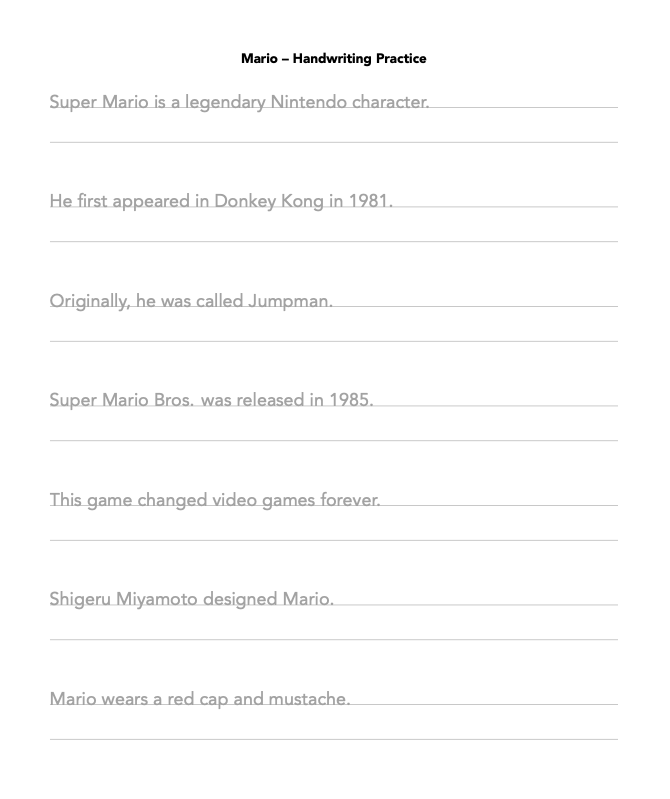
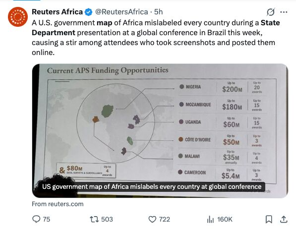






# 

<br>

[]{.large}

September 15, 2026

---





<br>
{fig-align="center" width=100%}

---




# Prompt:

## *"Make a one-page handwriting practice sheet<br>with sentences about **pokemon**"*

---



{fig-align="center" height="800"}

---





# Eight rounds later...

---



{fig-align="center" height="800"}

---



# I want [**these**]{.amber} sentences with [**this**]{.blue} layout

::: {.col .amberborder}
{fig-align="center" height="600"}
:::

::: {.col .blueborder}
{fig-align="center" height="600"}
:::

---



# If you ask AI for the *artifact*,

# the [Content]{.amber} is entangled with the [Format]{.blue}

::: {.col .amberborder}
{fig-align="center" height="600"}
:::

::: {.col .blueborder}
{fig-align="center" height="600"}
:::

---




<!--
  ENTANGLEMENT FIGURE, SLIDE 1 OF 2 — "ask for the document."

  Its job here is GENERALIZATION, not explanation: the handwriting sheet already
  taught the idea, so this only has to show the same shape without pokemon in it.

  The claim: the weaving happens inside one probabilistic pass, so the only lever
  you have on the content is to re-prompt and take another draw.

  BUILD. At rest, one loop, centered. Click 1: that loop LIFTS to the top third
  (CSS transform, see custom.css) and run 2 arrives under it. Click 2: run 3.
  The three loops are byte-identical to each other — literally one <use> of
  #loop — so the only thing that differs down the column is the document that
  falls out the end. That is the whole argument, and it has to be legible from
  the back of the room, which is why the three documents differ in SHAPE
  (stripes / dots / blocks) and not merely in stripe widths.

  The connectors matter: run 2 is not an edit of run 1, it is another full pass
  reached only by re-prompting. Nothing points from one document to the next.

  NO LEGEND, on purpose. The two previous slides teach the color vocabulary —
  one concretely (this layout / these sentences), one by naming it — so all this
  slide needs is the closing sentence from that second slide, carried across the
  top in the same two colors. A swatch legend said the same thing in 17px type
  nobody could read from the back.

  Everything else that used to be labelled is now spoken: no "ASK FOR THE
  DOCUMENT" (the sentence above says it), no run 1/2/3 (the stack says it), no
  summary caption (three different documents off one identical loop IS the
  caption).

  Colors are the deck's vocabulary and never change: amber = content/data,
  blue = structure/format, green = the human's direct action.

  NOTE: #doc is duplicated in slide 2's <defs> below and the two copies must stay
  byte-identical — that is the "you have not made a better document" point. They
  are NOT shared via one <use> across slides on purpose: reveal puts non-current
  slides in display:none, and cross-slide <use> resolution is unreliable there.
-->

```{=html}
<svg viewBox="0 0 1240 585" width="100%" style="max-height:80vh;"
     xmlns="http://www.w3.org/2000/svg"
     font-family="'Fira Sans Condensed', Tahoma, sans-serif">

  <defs>
    <!-- THE DOCUMENT. Amber and blue interleaved, irregular: content and format
         fused. Never drawn as a box inside a box — containment would imply they
         are already separate, which is the visual opposite of entanglement. -->
    <g id="doc">
      <rect x="0"   y="0" width="18" height="64" fill="#007bff"/>
      <rect x="18"  y="0" width="26" height="64" fill="#C0820F"/>
      <rect x="44"  y="0" width="14" height="64" fill="#007bff"/>
      <rect x="58"  y="0" width="32" height="64" fill="#C0820F"/>
      <rect x="90"  y="0" width="20" height="64" fill="#007bff"/>
      <rect x="110" y="0" width="16" height="64" fill="#C0820F"/>
      <rect x="126" y="0" width="28" height="64" fill="#007bff"/>
      <rect x="154" y="0" width="24" height="64" fill="#C0820F"/>
      <rect x="178" y="0" width="12" height="64" fill="#007bff"/>
      <rect x="190" y="0" width="28" height="64" fill="#C0820F"/>
      <rect x="218" y="0" width="22" height="64" fill="#007bff"/>
      <rect x="0"   y="0" width="240" height="64" fill="none"
            stroke="#121212" stroke-width="2.5"/>
    </g>

    <!-- Runs 2 and 3: same prompt, different draw. Same frame, same two colors,
         a completely different weave. The motif changes (stripes -> dots ->
         blocks) rather than just the proportions, because from row 10 a
         re-shuffled stripe pattern reads as "the same picture again." -->
    <g id="docDots">
      <rect x="0" y="0" width="240" height="64" fill="#FFFFFF"/>
      <circle cx="15"  cy="14" r="7" fill="#007bff"/>
      <circle cx="37"  cy="16" r="7" fill="#C0820F"/>
      <circle cx="58"  cy="13" r="7" fill="#C0820F"/>
      <circle cx="80"  cy="16" r="7" fill="#007bff"/>
      <circle cx="101" cy="14" r="7" fill="#C0820F"/>
      <circle cx="123" cy="15" r="7" fill="#007bff"/>
      <circle cx="144" cy="13" r="7" fill="#C0820F"/>
      <circle cx="166" cy="16" r="7" fill="#C0820F"/>
      <circle cx="187" cy="14" r="7" fill="#007bff"/>
      <circle cx="209" cy="15" r="7" fill="#C0820F"/>
      <circle cx="228" cy="13" r="7" fill="#007bff"/>
      <circle cx="25"  cy="32" r="7" fill="#C0820F"/>
      <circle cx="47"  cy="34" r="7" fill="#007bff"/>
      <circle cx="69"  cy="31" r="7" fill="#C0820F"/>
      <circle cx="90"  cy="33" r="7" fill="#C0820F"/>
      <circle cx="112" cy="32" r="7" fill="#007bff"/>
      <circle cx="134" cy="34" r="7" fill="#C0820F"/>
      <circle cx="155" cy="31" r="7" fill="#007bff"/>
      <circle cx="177" cy="33" r="7" fill="#C0820F"/>
      <circle cx="198" cy="32" r="7" fill="#007bff"/>
      <circle cx="220" cy="34" r="7" fill="#C0820F"/>
      <circle cx="15"  cy="50" r="7" fill="#C0820F"/>
      <circle cx="37"  cy="48" r="7" fill="#007bff"/>
      <circle cx="58"  cy="51" r="7" fill="#C0820F"/>
      <circle cx="80"  cy="49" r="7" fill="#007bff"/>
      <circle cx="101" cy="50" r="7" fill="#007bff"/>
      <circle cx="123" cy="48" r="7" fill="#C0820F"/>
      <circle cx="144" cy="51" r="7" fill="#007bff"/>
      <circle cx="166" cy="49" r="7" fill="#C0820F"/>
      <circle cx="187" cy="50" r="7" fill="#C0820F"/>
      <circle cx="209" cy="48" r="7" fill="#007bff"/>
      <circle cx="228" cy="51" r="7" fill="#C0820F"/>
      <rect x="0" y="0" width="240" height="64" fill="none"
            stroke="#121212" stroke-width="2.5"/>
    </g>

    <g id="docBlocks">
      <rect x="0" y="0" width="240" height="64" fill="#FFFFFF"/>
      <rect x="12"  y="7"  width="16" height="16" fill="#C0820F"/>
      <rect x="35"  y="5"  width="14" height="14" fill="#007bff"/>
      <rect x="56"  y="8"  width="15" height="15" fill="#C0820F"/>
      <rect x="79"  y="6"  width="17" height="17" fill="#007bff"/>
      <rect x="103" y="7"  width="14" height="14" fill="#C0820F"/>
      <rect x="124" y="5"  width="16" height="16" fill="#C0820F"/>
      <rect x="147" y="8"  width="15" height="15" fill="#007bff"/>
      <rect x="169" y="6"  width="14" height="14" fill="#C0820F"/>
      <rect x="191" y="7"  width="17" height="17" fill="#007bff"/>
      <rect x="215" y="5"  width="15" height="15" fill="#C0820F"/>
      <rect x="15"  y="27" width="15" height="15" fill="#007bff"/>
      <rect x="37"  y="29" width="14" height="14" fill="#C0820F"/>
      <rect x="59"  y="26" width="17" height="17" fill="#007bff"/>
      <rect x="83"  y="28" width="14" height="14" fill="#C0820F"/>
      <rect x="104" y="27" width="16" height="16" fill="#007bff"/>
      <rect x="127" y="29" width="15" height="15" fill="#C0820F"/>
      <rect x="149" y="26" width="14" height="14" fill="#C0820F"/>
      <rect x="170" y="28" width="17" height="17" fill="#007bff"/>
      <rect x="194" y="27" width="15" height="15" fill="#C0820F"/>
      <rect x="216" y="29" width="14" height="14" fill="#007bff"/>
      <rect x="12"  y="47" width="14" height="14" fill="#C0820F"/>
      <rect x="33"  y="45" width="16" height="16" fill="#007bff"/>
      <rect x="56"  y="48" width="14" height="14" fill="#C0820F"/>
      <rect x="77"  y="46" width="15" height="15" fill="#007bff"/>
      <rect x="99"  y="47" width="14" height="14" fill="#C0820F"/>
      <rect x="120" y="45" width="17" height="17" fill="#C0820F"/>
      <rect x="144" y="48" width="14" height="14" fill="#007bff"/>
      <rect x="165" y="46" width="16" height="16" fill="#C0820F"/>
      <rect x="188" y="47" width="15" height="15" fill="#007bff"/>
      <rect x="211" y="45" width="16" height="16" fill="#C0820F"/>
      <rect x="0" y="0" width="240" height="64" fill="none"
            stroke="#121212" stroke-width="2.5"/>
    </g>

    <!-- THE LOOP, drawn once and <use>d three times so the rows are provably
         identical. Local coords: the row's centerline is y = 0. -->
    <!-- The row is centred in the 1240-wide box: 211 units of margin either
         side. Both arrows are identical — same weight, same 50-unit run, same
         4-unit landing gap — because they are the same kind of step. -->
    <g id="loop">
      <rect x="211" y="-32" width="110" height="64" rx="6"
            fill="#FFFFFF" stroke="#121212" stroke-width="2.5"/>
      <text x="266" y="9" font-size="24" text-anchor="middle" fill="#121212">me</text>

      <path d="M 323 0 L 373 0" stroke="#121212" stroke-width="2.5"
            marker-end="url(#ahDark)"/>

      <!-- agent. dashed = the stochastic component. Same box in both slides:
           the agent is not what changes between them. -->
      <rect x="381" y="-32" width="180" height="64" rx="6"
            fill="#FFFFFF" stroke="#121212" stroke-width="2.5"
            stroke-dasharray="7 5"/>
      <text x="471" y="9" font-size="24" text-anchor="middle" fill="#121212">LLM agent</text>

      <!-- One jump, no intermediate, and deliberately unlabelled: the row
           repeats three times, so any text here repeats three times too. The
           emptiness under this arrow is exactly the space Quarto fills on the
           next slide — say "one probabilistic pass" out loud instead. -->
      <path d="M 563 0 L 613 0" stroke="#121212" stroke-width="2.5"
            marker-end="url(#ahDark)"/>
    </g>

    <!-- refX=5.5, not 7 (the tip). markerUnits defaults to strokeWidth, so the
         head scales with the line; parking the tip exactly on the path end
         leaves the line's blunt butt-cap poking out through the taper, because
         near the point the triangle is narrower than the stroke is thick.
         Backing refX off by 1.5 marker units pushes the head forward far enough
         that the stroke ends where the triangle is already wider than it —
         covered — while the visible tip lands 1.5x stroke-width past the path
         end. Path ends are set with that overhang subtracted. -->
    <marker id="ahDark" markerWidth="9" markerHeight="9" refX="5.5" refY="3"
            orient="auto"><path d="M0,0 L7,3 L0,6 z" fill="#121212"/></marker>
    <marker id="ahGray" markerWidth="9" markerHeight="9" refX="5.5" refY="3"
            orient="auto"><path d="M0,0 L7,3 L0,6 z" fill="#696969"/></marker>
  </defs>

  <!-- Carried verbatim from the slide before, in the same two colors. This is
       the legend now — a sentence they have already read once, at a size that
       survives the back of the room. -->
  <text x="620" y="46" font-size="50" text-anchor="middle" fill="#121212">
    <tspan fill="#C0820F">Content</tspan>
    <tspan> entangled with </tspan>
    <tspan fill="#007bff">Format</tspan>
  </text>

  <!-- RUN 1. `fragment custom lift` is a transform trigger, not a reveal
       effect: reveal's `:not(.custom)` rule leaves it visible at rest, and
       custom.css parks it 150 units low so it sits centered on its own, then
       releases it to y=175 on click 1. If that CSS ever goes missing the row
       simply renders in its final place and nothing breaks. -->
  <g class="fragment custom lift" data-fragment-index="1">
    <g transform="translate(0 175)">
      <use href="#loop"/>
      <g transform="translate(621 -54) scale(1.7)"><use href="#doc"/></g>
    </g>
  </g>

  <!-- RUN 2. The connector is the only route from one row to the next, and it
       lands on `me` — not on the document. You don't get to touch run 1; you
       get to ask again. -->
  <g class="fragment" data-fragment-index="1">
    <path d="M 825 233 L 825 245 Q 825 257 811 257 L 280 257 Q 266 257 266 269 L 266 301"
          fill="none" stroke="#696969" stroke-width="2.5"
          stroke-dasharray="7 5" marker-end="url(#ahGray)"/>
    <text x="545" y="279" font-size="22" fill="#696969"
          text-anchor="middle">review &amp; re-prompt</text>
    <g transform="translate(0 340)">
      <use href="#loop"/>
      <g transform="translate(621 -54) scale(1.7)"><use href="#docDots"/></g>
    </g>
  </g>

  <!-- RUN 3. -->
  <g class="fragment" data-fragment-index="2">
    <path d="M 825 398 L 825 410 Q 825 422 811 422 L 280 422 Q 266 422 266 434 L 266 466"
          fill="none" stroke="#696969" stroke-width="2.5"
          stroke-dasharray="7 5" marker-end="url(#ahGray)"/>
    <text x="545" y="444" font-size="22" fill="#696969"
          text-anchor="middle">review &amp; re-prompt</text>
    <g transform="translate(0 505)">
      <use href="#loop"/>
      <g transform="translate(621 -54) scale(1.7)"><use href="#docBlocks"/></g>
    </g>
  </g>

</svg>
```

::: {.notes}
Generalize what they just watched — don't re-explain it.

Same two things, same two colors. By the time I see the document they're fused —
one probabilistic pass wove them together, right there in the middle. Note the
dashed box: that step is a draw, not a computation.

Click 1. Same prompt, same model, same loop — line it up, it's the identical
picture — and look what comes out the end. Click 2. Again.

And notice what the arrow connects to. It never reaches the document above it.
It goes back to me. The second one isn't an edit of the first — the first is
thrown away and the whole thing is rewoven from scratch. Eight rounds of that is
how I lost the pokemon sentences.

So when a sentence is wrong, there's nothing to reach into. All I can do is
review, ask again, and take another draw.
:::

---




<!--
  ENTANGLEMENT FIGURE, SLIDE 2 OF 2 — "ask for the source."

  Deliberately the SAME left-hand composition as slide 1 (me -> agent, same
  boxes, same positions) so the pair reads as one picture with one thing
  changed. What changed is the middle: the agent now writes structure, the
  content sits beside it, and the weave happens at render.

  The output is the SAME #doc as run 1 on the previous slide, on purpose. The
  argument is NOT "this makes a better document" — it's that the weaving moved
  somewhere you can reach. Keep the two <defs> copies identical.
-->

```{=html}
<svg viewBox="0 0 1240 470" width="100%" style="max-height:80vh;"
     xmlns="http://www.w3.org/2000/svg"
     font-family="'Fira Sans Condensed', Tahoma, sans-serif">

  <defs>
    <!-- Byte-identical to #doc on the previous slide. If you edit one, edit
         both — the whole point is that the output did not change. -->
    <g id="docOut">
      <rect x="0"   y="0" width="18" height="64" fill="#007bff"/>
      <rect x="18"  y="0" width="26" height="64" fill="#C0820F"/>
      <rect x="44"  y="0" width="14" height="64" fill="#007bff"/>
      <rect x="58"  y="0" width="32" height="64" fill="#C0820F"/>
      <rect x="90"  y="0" width="20" height="64" fill="#007bff"/>
      <rect x="110" y="0" width="16" height="64" fill="#C0820F"/>
      <rect x="126" y="0" width="28" height="64" fill="#007bff"/>
      <rect x="154" y="0" width="24" height="64" fill="#C0820F"/>
      <rect x="178" y="0" width="12" height="64" fill="#007bff"/>
      <rect x="190" y="0" width="28" height="64" fill="#C0820F"/>
      <rect x="218" y="0" width="22" height="64" fill="#007bff"/>
      <rect x="0"   y="0" width="240" height="64" fill="none"
            stroke="#121212" stroke-width="2.5"/>
    </g>

    <!-- Byte-identical to #docOut except every amber fill is green. Same
         rects, same widths, same order — if you touch one, touch both, or the
         click stops meaning "only the content changed". -->
    <g id="docOutEdited">
      <rect x="0"   y="0" width="18" height="64" fill="#007bff"/>
      <rect x="18"  y="0" width="26" height="64" fill="#38B44A"/>
      <rect x="44"  y="0" width="14" height="64" fill="#007bff"/>
      <rect x="58"  y="0" width="32" height="64" fill="#38B44A"/>
      <rect x="90"  y="0" width="20" height="64" fill="#007bff"/>
      <rect x="110" y="0" width="16" height="64" fill="#38B44A"/>
      <rect x="126" y="0" width="28" height="64" fill="#007bff"/>
      <rect x="154" y="0" width="24" height="64" fill="#38B44A"/>
      <rect x="178" y="0" width="12" height="64" fill="#007bff"/>
      <rect x="190" y="0" width="28" height="64" fill="#38B44A"/>
      <rect x="218" y="0" width="22" height="64" fill="#007bff"/>
      <rect x="0"   y="0" width="240" height="64" fill="none"
            stroke="#121212" stroke-width="2.5"/>
    </g>

    <!-- refX=5.5 for the same reason as slide 1's markers: at 7 the tip sits on
         the path end and the stroke poked out through the taper. -->
    <marker id="ahDark2" markerWidth="9" markerHeight="9" refX="5.5" refY="3"
            orient="auto"><path d="M0,0 L7,3 L0,6 z" fill="#121212"/></marker>
    <marker id="ahAmber2" markerWidth="9" markerHeight="9" refX="5.5" refY="3"
            orient="auto"><path d="M0,0 L7,3 L0,6 z" fill="#C0820F"/></marker>
    <marker id="ahGreen2" markerWidth="9" markerHeight="9" refX="5.5" refY="3"
            orient="auto"><path d="M0,0 L7,3 L0,6 z" fill="#38B44A"/></marker>
  </defs>

  <!-- The same sentence as slide 1, with two words inserted. Deliberately the
       maximum callback: the room re-reads a line it already knows and the only
       thing that changed is the claim. Same reason there's no legend here. -->
  <text x="620" y="46" font-size="50" text-anchor="middle" fill="#121212">
    <tspan> Quarto disentangles </tspan>
    <tspan fill="#C0820F">Content</tspan>
    <tspan> and </tspan>
    <tspan fill="#007bff">Format</tspan>
  </text>

  <!-- me. The whole row sits on y=180, the .qmd box's centre line. -->
  <rect x="30" y="148" width="96" height="64" rx="6"
        fill="#FFFFFF" stroke="#121212" stroke-width="2.5"/>
  <text x="78" y="187" font-size="22" text-anchor="middle" fill="#121212">me</text>

  <!-- no loop back on this slide: the agent runs once, not round and round -->
  <text x="150" y="136" font-size="16" fill="#696969"
        text-anchor="middle">prompt once</text>
  <path d="M 128 180 L 170 180" stroke="#121212" stroke-width="2.5"
        marker-end="url(#ahDark2)"/>

  <!-- agent. STILL dashed — still probabilistic. That's the honest part: the
       agent didn't get better, the thing it writes did. -->
  <rect x="178" y="148" width="156" height="64" rx="6"
        fill="#FFFFFF" stroke="#121212" stroke-width="2.5"
        stroke-dasharray="7 5"/>
  <text x="256" y="187" font-size="22" text-anchor="middle" fill="#121212">LLM agent</text>

  <text x="364" y="168" font-size="17" fill="#121212"
        text-anchor="middle">writes</text>
  <path d="M 338 180 L 390 180" stroke="#121212" stroke-width="2.5"
        marker-end="url(#ahDark2)"/>

  <!-- THE .qmd — a NEUTRAL container, black-stroked, holding both halves in
       named places. This is the one box in the deck where content may sit
       inside format's colour scheme, and it is legal precisely because the
       container is not blue: it is a file, not a format. Nesting here is the
       truth (a .qmd really does hold both), which is the opposite of the
       output bar, where nesting would be a lie.

       The blue is the YAML, and saying so is worth the ink: it makes "format"
       a thing this room can point at, and it is what Act 6's "change one word"
       changes. Two solid blocks, no further annotation — the file's job here is
       to show that each half has a PLACE, not to be read. -->
  <text x="493" y="106" font-size="22" text-anchor="middle"
        fill="#121212" font-family="SFMono-Regular, Menlo, monospace">.qmd</text>
  <rect x="398" y="118" width="190" height="124" rx="6"
        fill="#FFFFFF" stroke="#121212" stroke-width="2.5"/>
  <rect x="414" y="134" width="158" height="36" fill="#007bff"/>
  <text x="493" y="159" font-size="20" text-anchor="middle"
        fill="#FFFFFF" font-family="SFMono-Regular, Menlo, monospace">yaml</text>
  <!-- The content block swaps to green on click 2 — see the note on the output
       bar below for what that click is arguing. -->
  <g class="fragment fade-out" data-fragment-index="2">
    <rect x="414" y="182" width="158" height="44" fill="#C0820F"/>
    <text x="493" y="211" font-size="20" text-anchor="middle"
          fill="#FFFFFF" font-family="SFMono-Regular, Menlo, monospace">content</text>
  </g>
  <g class="fragment" data-fragment-index="2">
    <rect x="414" y="182" width="158" height="44" fill="#38B44A"/>
    <text x="493" y="211" font-size="20" text-anchor="middle"
          fill="#FFFFFF" font-family="SFMono-Regular, Menlo, monospace">content</text>
  </g>

  <!-- data = the exact values, living OUTSIDE in a file of their own. Still
       amber, because data is content — what differs is the kind of address
       (a row, not a line number). No arrow reaches it from the agent, and none
       from me either: data comes from the world. Centred under the .qmd: the
       green arrow gets out of its way by entering further left, not by pushing
       this off-axis. -->
  <rect x="433" y="300" width="120" height="56" rx="6"
        fill="#FFFFFF" stroke="#C0820F" stroke-width="3.5"/>
  <text x="493" y="337" font-size="22" text-anchor="middle"
        fill="#C0820F" font-family="SFMono-Regular, Menlo, monospace">data</text>
  <path d="M 493 296 L 493 250" fill="none" stroke="#C0820F" stroke-width="2.5"
        marker-end="url(#ahAmber2)"/>

  <!-- One input, one output. `quarto render` takes the .qmd; the data is
       pulled in by it. -->
  <text x="669" y="166" font-size="20" fill="#121212"
        text-anchor="middle">render</text>
  <path d="M 592 180 L 746 180" stroke="#121212" stroke-width="2.5"
        marker-end="url(#ahDark2)"/>

  <!-- The same document as run 1. Deliberately, provably unchanged. Same two
       colours as the .qmd box above — but here they interleave with no
       boundary, and there they each have a place. That contrast IS the address
       argument, so keep both on screen together.

       CLICK 2 swaps it for #docOutEdited, which is the same bar with the amber
       bands turned green. The blue bands are byte-identical and do NOT move:
       you changed the content, so only the content changed. Every band stayed
       exactly where it was, which is the thing a regenerated document can never
       promise. Green because green has meant "your direct action" all along —
       the green bands are the ones your hand reached. -->
  <g class="fragment fade-out" data-fragment-index="2">
    <g transform="translate(768 126) scale(1.7)"><use href="#docOut"/></g>
  </g>
  <g class="fragment" data-fragment-index="2">
    <g transform="translate(768 126) scale(1.7)"><use href="#docOutEdited"/></g>
  </g>

  <!-- The payoff, and now a single arrow: you reach past the agent into the
       source itself. Both halves inside it are yours — the yaml and the
       content — so it lands on the file, not on one block. Green = your direct
       action, and it is the only new colour on the slide.
       stroke-width 2.5 like every other arrow on both slides: markerUnits is
       strokeWidth, so a fatter line also means a fatter head. At 3 the head ran
       16.5 units back from the tip and sat on top of the corner. -->
  <g class="fragment" data-fragment-index="1">
    <path d="M 78 216 L 78 270 Q 78 282 90 282 L 406 282 Q 418 282 418 270 L 418 250"
          fill="none" stroke="#38B44A" stroke-width="2.5"
          marker-end="url(#ahGreen2)"/>
    <text x="250" y="308" font-size="20" fill="#38B44A"
          text-anchor="middle">you edit directly</text>
  </g>

</svg>
```

---



<!--
  THE PAYOFF — the abstraction cashed out in the real sheets, and the answer to
  Act 1. It is deliberately the same shape as figure slide 1 (three variants of
  one identical thing) with the meaning inverted: there, one unchanged input
  gave three different documents; here, three changed inputs give three
  documents that differ ONLY where they were changed.

  What carries it is what DOESN'T vary. The `.qmd` box is the same box from the
  slide before, at the same 190x124, and the blue `yaml` band is byte-identical
  in all three columns. Only the content block changes — one word, one colour —
  and the sheets below differ in exactly that and nothing else. Same layout,
  same margins, same everything. That is "no drift", shown rather than claimed.

  Colours: amber / purple / red. NOT green, deliberately — green means "your
  direct action" and it was on screen one slide ago as the content you had just
  edited; a green block here would read as "this is the edited one". Thematic
  colours (pokemon amber, minecraft green, mario red) are tempting and would be
  charming; they cost that.

  No `render` label under the arrows: three of them would be three repetitions
  of a word the previous slide just taught. Same rule as `#loop` on slide 1 —
  anything in a repeated unit costs 3x.
-->

# Same [format]{.blue}. No drift.

::: {.col .center}
```{=html}
<svg viewBox="0 0 240 200" width="216" height="180"
     xmlns="http://www.w3.org/2000/svg"
     font-family="'Fira Sans Condensed', Tahoma, sans-serif">
  <text x="120" y="20" font-size="20" text-anchor="middle"
        fill="#121212" font-family="SFMono-Regular, Menlo, monospace">.qmd</text>
  <rect x="25" y="30" width="190" height="124" rx="6"
        fill="#FFFFFF" stroke="#121212" stroke-width="2.5"/>
  <rect x="41" y="46" width="158" height="36" fill="#007bff"/>
  <text x="120" y="71" font-size="20" text-anchor="middle"
        fill="#FFFFFF" font-family="SFMono-Regular, Menlo, monospace">yaml</text>
  <rect x="41" y="94" width="158" height="44" fill="#C0820F"/>
  <text x="120" y="123" font-size="20" text-anchor="middle"
        fill="#FFFFFF" font-family="SFMono-Regular, Menlo, monospace">pokemon</text>
  <path d="M 120 162 L 120 178" stroke="#121212" stroke-width="2.5"/>
  <path d="M 112.5 175 L 120 192.5 L 127.5 175 z" fill="#121212"/>
</svg>
```

{fig-align="center" height="330"}
:::

::: {.col .center}
```{=html}
<svg viewBox="0 0 240 200" width="216" height="180"
     xmlns="http://www.w3.org/2000/svg"
     font-family="'Fira Sans Condensed', Tahoma, sans-serif">
  <text x="120" y="20" font-size="20" text-anchor="middle"
        fill="#121212" font-family="SFMono-Regular, Menlo, monospace">.qmd</text>
  <rect x="25" y="30" width="190" height="124" rx="6"
        fill="#FFFFFF" stroke="#121212" stroke-width="2.5"/>
  <rect x="41" y="46" width="158" height="36" fill="#007bff"/>
  <text x="120" y="71" font-size="20" text-anchor="middle"
        fill="#FFFFFF" font-family="SFMono-Regular, Menlo, monospace">yaml</text>
  <rect x="41" y="94" width="158" height="44" fill="#7B5CD6"/>
  <text x="120" y="123" font-size="20" text-anchor="middle"
        fill="#FFFFFF" font-family="SFMono-Regular, Menlo, monospace">minecraft</text>
  <path d="M 120 162 L 120 178" stroke="#121212" stroke-width="2.5"/>
  <path d="M 112.5 175 L 120 192.5 L 127.5 175 z" fill="#121212"/>
</svg>
```

{fig-align="center" height="330"}
:::

::: {.col .center}
```{=html}
<svg viewBox="0 0 240 200" width="216" height="180"
     xmlns="http://www.w3.org/2000/svg"
     font-family="'Fira Sans Condensed', Tahoma, sans-serif">
  <text x="120" y="20" font-size="20" text-anchor="middle"
        fill="#121212" font-family="SFMono-Regular, Menlo, monospace">.qmd</text>
  <rect x="25" y="30" width="190" height="124" rx="6"
        fill="#FFFFFF" stroke="#121212" stroke-width="2.5"/>
  <rect x="41" y="46" width="158" height="36" fill="#007bff"/>
  <text x="120" y="71" font-size="20" text-anchor="middle"
        fill="#FFFFFF" font-family="SFMono-Regular, Menlo, monospace">yaml</text>
  <rect x="41" y="94" width="158" height="44" fill="#E74A2F"/>
  <text x="120" y="123" font-size="20" text-anchor="middle"
        fill="#FFFFFF" font-family="SFMono-Regular, Menlo, monospace">mario</text>
  <path d="M 120 162 L 120 178" stroke="#121212" stroke-width="2.5"/>
  <path d="M 112.5 175 L 120 192.5 L 127.5 175 z" fill="#121212"/>
</svg>
```

{fig-align="center" height="330"}
:::

::: {.notes}
This is the answer to the sheet I opened with.

Three sheets, three topics, and I never touched the layout — same margins, same
guide lines, same everything. The only thing I changed is the one block that
says what it's about. Nothing drifted, because there was nothing to drift: the
layout isn't being re-decided every time, it's being re-run.

And I didn't proofread three documents. I proofread one word, three times.
:::

---





# Agents should write the source,<br>not the artifact

---





# Building trust

---

{fig-align="center" width=100%}

---





# Quarto is _token efficient_

---





# …and, unexpectedly, it's cheaper

<center>

</center>

---





# Easy to deploy (serverless)

---

[Left off here]


---

## You can't prompt your way to correctness

[You architect it.]{.font160 .blue}

::: {.notes}
The prescription. Note what it's NOT: better prompts, better evals, better
models. Shrink the surface that has to be probabilistic at all.
:::

---





# And it's also efficient

::: {.notes}
ACT 3. THE TURN. The audience is braced for a worthiness argument about
correctness. Give them an argument about cost instead.
:::

---

## It's also cheaper

Same prompt, same model. Only the output target changes.

| Asked for | Direct | Via `.qmd` |
|-----------|-------:|-----------:|
| Word      | 8,097  | **1,121**  |
| HTML      | 4,046  | **1,022**  |
| PDF       | 1,992  | **1,123**  |
| Markdown  | 1,267  | **1,282**  |

::: {.notes}
Don't read the numbers. Point at the SHAPE.

Left column: wild swings — 1,267 up to 8,097 — because the agent is typing the
artifact, and some artifacts are miserable to type. Office Open XML is 8,000
tokens of raw XML.

Right column is FLAT. Around a thousand, every time. The agent never spends a
token on the artifact — the renderer does that part for free.

Note the honest row: for Markdown it's a wash. Say so. Costs nothing, buys trust.
:::

---

## And that's just the first turn

> **[CHART or TABLE — multi-turn token cost]**
> Cost growth across an agentic session, direct output vs. `.qmd`.
> Author to supply — numbers from the revised blog post.

Every edit to a fused artifact **regenerates the whole thing.**

An edit to a `.qmd` is a **diff.**

::: {.notes}
CALLBACK TO ACT 1 — make it explicit: "remember the sheet? I asked it to change
one sentence and it rebuilt the entire page. That wasn't just a correctness
problem. I paid full price for it."

This is the same phenomenon as the cold open, now measured instead of narrated.
The single-shot table understates the case, because nobody generates once —
you iterate. The gap doesn't stay at 7×; it compounds with every turn.
:::

---





# This is how you build anything

::: {.notes}
ACT 4. THE DASHBOARD. ~6 minutes. The most concrete material in the talk,
deliberately mid-deck where running long can't reach it.

This is a REAL product: vehicletrends.us. 10M+ vehicle listings, multi-page,
interactive, updates itself weekly. Built with exactly the workflow from Act 1–3.
:::

---

## A real one: vehicletrends.us

> **[RECORDING — silent screen capture, ~75s]**
> Multi-page Quarto site. ECharts line charts + boxplots, a MapLibre census-tract
> map, a Shinylive app — all client-side. 10M+ listings.

::: {.notes}
No audio. Narrate lightly. Don't tour features — this is evidence.

Say "data product." It's this session's shared vocabulary, and it's literally
what this is: data + a package + a site, not a one-off report.
:::

---

## The handwriting sheet, forty pages over

::: {.col}
[**The agent wrote:**]{.blue}

- the `.qmd` for each page — prose + layout
- small R chunks that *emit* charts
- the `_quarto.yml`, the glue
:::

::: {.col}
[**The agent never touched:**]{.amber}

- the data — it lives in an R package
- the numbers — recomputed at render
- the map, the app — separate projects
:::

[Same move. Bigger artifact.]{.font140 .green}

::: {.notes}
The scale changed; the move didn't. The data isn't in the repo — it's an external
package the pages read at render (setup.R pulls CSVs). Every number on every page
has an address. A weekly GitHub Action re-renders; the site is never stale, and
nobody regenerates anything.
:::

---





# "But why not just build<br>a Shiny app?"

::: {.notes}
NAME THE OBJECTION FIRST. This is THE elephant in a Posit dashboards session —
everyone is thinking it. Say it out loud.

Shiny is great. This isn't an attack. It's about what you have to hand the agent.
:::

---

## Shiny feels like asking the agent for the artifact

::: {.col width="55%"}
[**Shiny**]{.red}

To get one chart on screen: define the UI, wire an input, wire an output, write
the server, manage reactivity.

The interactivity is a **machine you assemble** — and the agent writes all of it,
then you run a server to hold it up.
:::

::: {.col width="45%"}
[**Quarto**]{.blue}

Write markdown. Drop a code chunk that returns an ECharts widget.

The interactivity ships **inside the widget**, in the browser. Nothing to wire,
no server to run.
:::

::: {.notes}
This is the PDF problem again, one level up. A Shiny UI is an artifact you must
fully specify — lots of writing, lots of wiring, lots of tokens, and a server at
the end. Quarto lets the agent write source and lets the browser do the rest.

Honest concession available here: if you genuinely need server-side compute over
data too big for the browser, that's Shiny's home turf. Take it.
:::

---

## Need something heavier? Put it in a box

::: {.col}
The census-tract map is the hardest thing on the site.

It's **not in the dashboard.** It's its own repo — `hhi-map` — built and iterated
in isolation, then dropped in:

```r
htmltools::tags$iframe(
  src = "https://vehicletrends.github.io/hhi-map/",
  height = "700px", width = "100%"
)
```
:::

::: {.col}
> **[SCREENSHOT — the MapLibre map on market-concentration.qmd]**
:::

::: {.notes}
The map is MapLibre + PMTiles — genuinely complex. Building it inside the
dashboard would mean holding the whole site in context to work on one component.

Instead: separate project, small surface, iterate fast with the agent, then a
six-line iframe. It loads instantly — PMTiles on a CDN — and it's on GitHub
Pages. No server.
:::

---

## Small pieces have small context windows

Isolate a component →

- the agent holds **all of it** in one context
- you iterate on it **without touching the site**
- it drops back in as an `iframe`

[The whole dashboard is never in scope at once. Neither is the token bill.]{.font120 .green}

::: {.notes}
This is the efficiency argument made architectural. Composition isn't just clean
engineering — it's what keeps each AI interaction cheap and each component
individually correct. The map, the Shinylive app, each page: all small.
:::

---

## It's just static files

Everything here runs in the browser and deploys to GitHub Pages — **for free.**

- charts → ECharts (JS), rendered client-side
- the map → PMTiles on a CDN, instant
- the Shiny app → **Shinylive**, compiled to WebAssembly. No server.

[No server to run. No server to secure. No server to pay for.]{.font120}

::: {.notes}
The payoff. Even the Shiny app has no server — Shinylive runs R in the browser via
WASM. A "dashboard" that is entirely static files is faster, cheaper, and simpler
to keep alive than anything server-backed — and the agent helped build every
piece of it.
:::

---





# "So why not just<br>ask for HTML?"

::: {.notes}
ACT 5. Name the objection before the audience can. Do NOT reference anyone
else's post — this is your objection, in your voice.
:::

---

## Honestly — the case for HTML is good

- Rich, structured, immediately viewable
- No toolchain, no render step, opens anywhere
- Infinitely more useful than a wall of Markdown
- Agents are *very* good at it

::: {.notes}
Make this case generously and at full strength. Steelman it. You lose nothing by
being fair here and you gain the room's trust for the turn.

The throwaway-editor concession is genuine — say it and mean it.
:::

---

## HTML is great for Isolated subcomponents, but not the whole thing

---

## But HTML can't tell you it's broken

::: {.col}
[**HTML**]{.red}

No compile step.

Malformed output still renders as *something*.

The agent cannot tell whether it succeeded.
:::

::: {.col}
[**`.qmd`**]{.blue}

Bad cross-reference, failed chunk, invalid YAML → **loud, deterministic error.**

The agent reads it and fixes it — without you.
:::

::: {.notes}
THE KILL SHOT of Act 5. This is the sharpest thing in the talk.

Documents just got a compile step. Code has had one for decades. Documents get
one exactly at the moment their authors became probabilistic.
:::

---

## Quarto is checkable twice

::: {.col}
[**By machine**]{.darkgreen}

`quarto render` is a compile step. Failures are loud and specific.
:::

::: {.col}
[**By human**]{.darkgreen}

Plain text means the agent's edit is a **diff**. Review scales with the change,
not the document.
:::

::: {.notes}
Both halves matter. git revert is a one-command undo for any agent mistake.
:::

---





# Close

---

## You don't need to know Quarto to get started

Change **one word** in your prompt.

[Ask for the `.qmd`.]{.font160 .blue}

::: {.notes}
The accessibility close. This is for everyone in the room, not just power users.
:::

---

## Make this work Monday

1. Put *"always run `quarto render` before finishing"* in your `CLAUDE.md`
2. Have the agent work on a branch, so edits arrive as diffs
3. Keep data in files the `.qmd` reads — never in the prompt

---





# Software solved this<br>decades ago.

[Source and artifact. Documents are only getting there now —]{.font120}
[right when the authors became probabilistic.]{.font120 .orange}

---





# Agents should write the source,<br>not the artifact.
