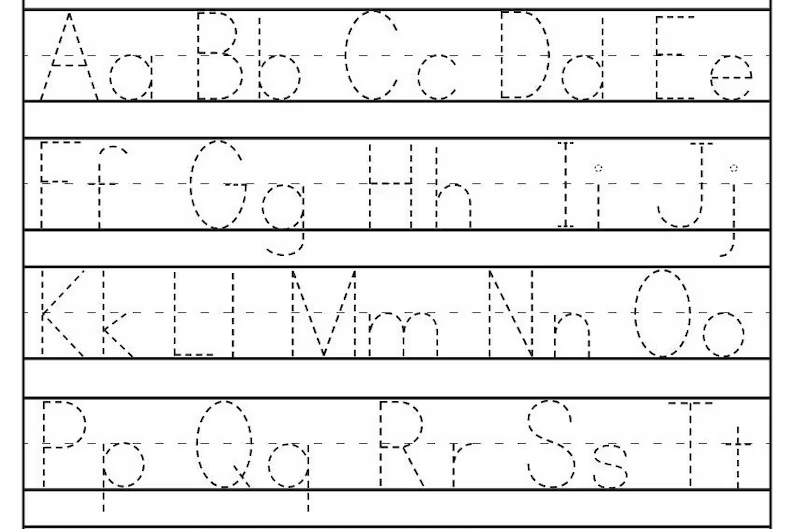
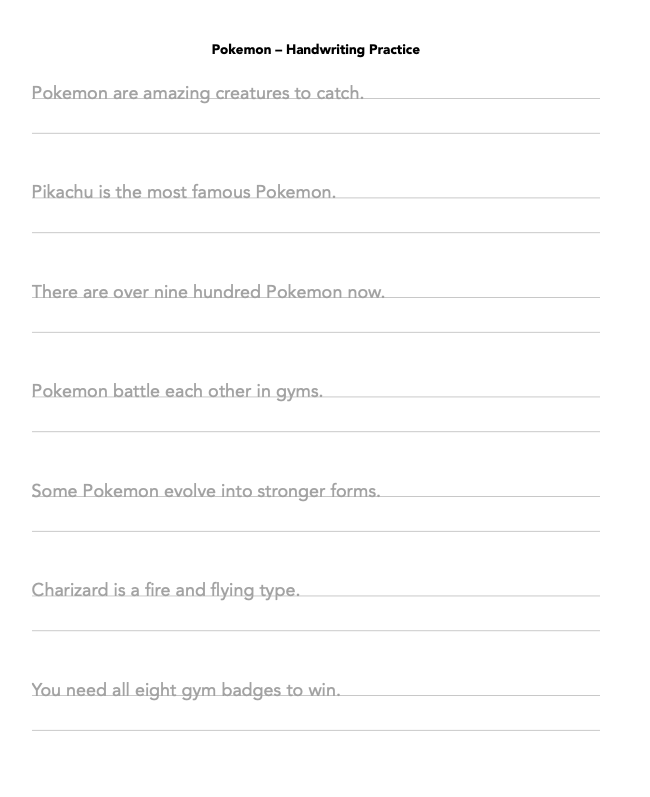
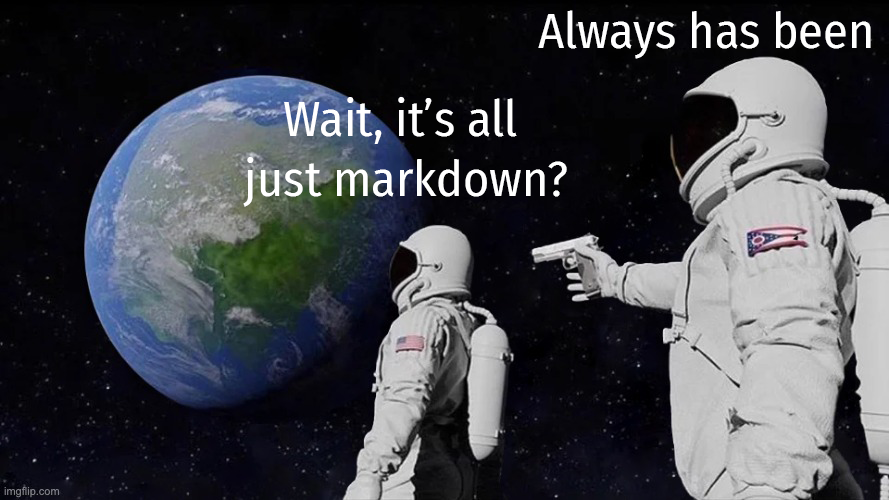
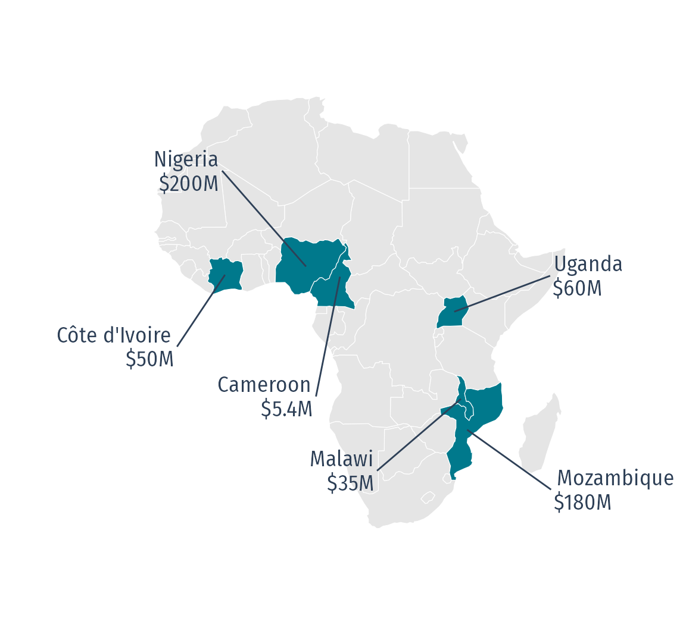

```{r}
#| label: setup
#| include: false

library(dplyr)
library(echarts4r)
library(vehicletrends)
library(palmerpenguins)
library(crosstalk)
library(plotly)
library(DT)

knitr::opts_chunk$set(
  warning = FALSE,
  message = FALSE,
  fig.path = "figs/",
  fig.width = 7.252,
  fig.height = 4,
  comment = "#>",
  fig.retina = 3
)

sp <- function(gap = 2, unit = "em") {
  sprintf('<div style="height: %s%s;"></div>', gap, unit)
}
```







# 

<br>

# 

<br>

[]{.large}

[posit::conf(2026)<br>Houston, TX]{.font120}

::: {.notes}

:::

---






# Handwriting practice sheets

<center>

</center>

::: {.notes}

This is a dashboard session, but we are starting with a handwriting worksheet. The worksheet is deliberately simple because it makes the underlying problem obvious.

:::

---




# Prompt:

## *"Make a one-page handwriting practice sheet<br>with sentences about **pokemon**"*

---



{fig-align="center" height="800"}

---




---



{fig-align="center" height="800"}

---



# I want [**these**]{.contentchip} sentences with [**this**]{.formatchip} layout

::: {.col .amberborder}
{fig-align="center" height="600"}
:::

::: {.col .blueborder}
{fig-align="center" height="600"}
:::

---




# [Content]{.contentchip} entangled with [Format]{.formatchip}



---





`r sp(6)`

::: {.col width="10%"}
:::

::: {.col width="35%"}
## 
:::

::: {.col width="55%"}
`r sp(1.5)`

# Quarto disentangles 

# [Content]{.contentchip} and [Format]{.formatchip}
:::

---




# Quarto disentangles [Content]{.contentchip .fragment .custom .turnsred data-fragment-index="3"} and [Format]{.formatchip}



---

# [Modularized content via parameters]{.center}

:::: {.col width="58%"}
[]{.font120}

[**handwriting-practice.qmd**]{.qmdblue .font120}

(written by Claude Code)

<br>

::: {.font70}
````{.markdown}
---
params:
  data_file: "data/minecraft.csv"
format: pdf
---

```{{r}}
sentences <- read.csv(params$data_file)$sentence
for (s in sentences) {
  cat(sprintf("\\practiceblock{%s}\n\n", s))
}
```
````
:::
::::

:::: {.col width="42%"}
[]{.red .font120}

[**minecraft.csv**]{.red .font120}

(written by Me)

<br>

:::{.font70}
|sentence |
|-----|
|Minecraft is a popular building game.|
|Players mine for resources underground.|
|You can build almost anything you want.|
|Creepers are sneaky and dangerous enemies.|
|Diamonds are the best ore to find.|
|Players must survive through the first night.|
|The Nether is a hot and scary place.|
:::

::::

---





::: {.col .center}
{fig-align="center" height="470"}
:::

::: {.col .center}
{fig-align="center" height="470"}
:::

---






# [Quarto is a *canvas* for *modular content*]{.font120}

## 

---





<br>
{fig-align="center" width=100%}

---






---



::: {.col width="40%"}

:::

::: {.col width="50%" valign="middle" .fragment}
### [_quarto.yml]{.formatchip}

```yaml
project:
  type: website

website:
  sidebar:
    contents:
      - about.qmd
      - vmt-daily.qmd
      - vmt-age.qmd
      - depreciation.qmd
      - ...
```
:::

---



::: {.col width="40%"}

:::

::: {.col width="50%" valign="middle"}
### [_quarto.yml]{.formatchip}

```yaml
project:
  type: website

website:
  sidebar:
    contents:
      - about.qmd
      - vmt-daily.qmd
      - vmt-age.qmd
      - depreciation.qmd
      - ...
```

<br>

### [Charts built with {vehicletrends}]{.contentchip}
:::

---



::: {.col width="50%" .font130}
<br>

## A cohesive framework:

→ URLs to each page<br>
→ URLs to each header<br>
→ Navigation<br>
→ Consistent layout<br>
→ Easy deployment

:::

::: {.col width="50%"}

### [_quarto.yml]{.formatchip}

```yaml
project:
  type: website

website:
  sidebar:
    contents:
      - about.qmd
      - vmt-daily.qmd
      - vmt-age.qmd
      - depreciation.qmd
      - ...
```

<br>

### [Charts built with {vehicletrends}]{.contentchip}
:::

---





`r sp(6)`

::: {.col width="10%"}
:::

::: {.col width="40%"}
## 
:::

::: {.col width="50%"}
`r sp(3.2)`

# [Modularity]{.font150}
:::

---



::: {.col width="5%"}
:::

::: {.col width="25%"}

:::

::: {.col width="70%" valign="middle"}
# Each page is its own canvas
:::

---

## [(Things to put in the canvas)]{.center .gray}

# [JavaScript graphics via []{.blue} or []{.yellow} packages]{.center}

::: {.col width="50%"}
[**R**]{.blue} via {echarts4r}

::: {.font70}
```r
penguins |>
  group_by(species) |>
  e_charts(bill_length_mm) |>
  e_scatter(flipper_length_mm)
```
:::

[**Python**]{.yellow} via {plotly}

::: {.font70}
```python
px.scatter(
  penguins,
  x = "bill_length_mm",
  y = "flipper_length_mm",
  color = "species"
)
```
:::
:::

::: {.col width="50%"}
```{r}
penguins |>
  tidyr::drop_na(bill_length_mm, flipper_length_mm, species) |>
  group_by(species) |>
  # Square canvas, set explicitly rather than left to the column width, so the
  # aspect ratio doesn't move if the 60/40 split ever changes. 560 is what
  # fits under the title on a 900px slide.
  e_charts(bill_length_mm, width = "600px", height = "560px") |>
  e_scatter(flipper_length_mm, symbol_size = 9) |>
  # `background` is e_color's second argument, and it sets echarts' top-level
  # backgroundColor. The canvas is transparent by default, so the chart sat
  # straight on the slide's grey; white matches the plotly and Plot panels on
  # the next two slides.
  e_color(c("#00798c", "#A77400", "#d1495b"), background = "#FFFFFF") |>
  e_legend(bottom = 0, textStyle = list(fontSize = 16)) |>
  e_tooltip() |>
  # scale = TRUE drops echarts' default "always include zero" on a value axis,
  # which otherwise parks the whole cloud in the top-right corner. boundaryGap
  # then pads the data range by 5% so the points don't touch the frame.
  e_x_axis(
    name = "Bill length (mm)",
    scale = TRUE,
    boundaryGap = c("5%", "5%")
  ) |>
  e_y_axis(
    name = "Flipper length (mm)",
    nameLocation = "middle",
    nameGap = 45,
    scale = TRUE,
    boundaryGap = c("5%", "5%")
  ) |>
  e_grid(left = 80, right = 30, top = 20, bottom = 80)
```
:::

::: {.notes}

"The page doesn't care which visualization library I'm using."

:::

---

## [(Things to put in the canvas)]{.center .gray}

## [Widgets that talk to each other:<br>`crosstalk` + `plotly`, or `ojs`]{.center}

::: {.font55}
```{r}
# Two plots over one SharedData, with a dropdown and a slider above them, so the
# slide reads as a small app rather than as two widgets that happen to share a
# page. The table this replaced made the same crosstalk point but looked like a
# report; a second plot makes the linking visible, because a selection in one
# panel is legible in the other.
#
# `dragmode = "select"` matters on stage: without it a drag pans the plot and the
# audience never sees the link unless you first find the box-select button in the
# modebar. With it, drag a box and both panels respond.
pen <- palmerpenguins::penguins |>
  tidyr::drop_na(
    bill_length_mm,
    bill_depth_mm,
    flipper_length_mm,
    body_mass_g,
    species
  )
shared <- SharedData$new(pen)

pal <- c("#00798c", "#A77400", "#d1495b")

panel <- function(x, y, xlab, ylab) {
  plot_ly(
    shared,
    x = x,
    y = y,
    color = ~species,
    colors = pal,
    type = "scatter",
    mode = "markers",
    marker = list(size = 8, opacity = 0.8),
    # Both dimensions in pixels, on purpose. Left to autosize, plotly measures
    # its container at document-ready -- which on a reveal deck is while the
    # slide is still `display: none`, so it lays out against a garbage width and
    # draws a plot far bigger than the box, with the points off-screen and no
    # x-axis in view. A fixed size cannot be measured wrong. 500 x 460 is what
    # two panels plus the control rail fit into 1420px of usable slide width.
    width = 500,
    height = 460
  ) |>
    layout(
      showlegend = FALSE,
      dragmode = "select",
      xaxis = list(title = xlab),
      yaxis = list(title = ylab),
      margin = list(l = 60, r = 10, t = 10, b = 50)
    ) |>
    highlight(
      on = "plotly_selected",
      off = "plotly_deselect",
      color = "#2e4057"
    )
}

# Every width here is fixed in pixels rather than a percentage. Percentages
# resolve against a container that reveal has not laid out yet on the first
# visit to the slide, and a flex item with no `min-width: 0` cannot shrink below
# its content -- so one mis-measured panel used to take the whole row and squeeze
# the other one to nothing. 300 + 500 + 500 plus the two gaps fits the 1420px of
# usable slide width with room to spare.
htmltools::div(
  style = "display:flex; gap:1.6rem; align-items:flex-start; justify-content:center;",

  # Controls stacked in their own left column, slider over dropdown. Stacking
  # them beside the plots instead of above is what makes the slide read as an
  # app: a control rail is the shape people recognise, and it buys the plots
  # enough height to come out roughly square.
  htmltools::div(
    style = "flex:0 0 300px; min-width:0; padding-top:0.6rem;",
    filter_slider(
      "mass",
      "Body mass (g)",
      shared,
      ~body_mass_g,
      width = "100%"
    ),
    htmltools::div(
      style = "margin-top:1.2rem;",
      filter_select("sp", "Species", shared, ~species)
    )
  ),

  htmltools::div(
    style = "flex:0 0 auto; display:flex; gap:1.2rem;",
    htmltools::div(
      style = "flex:0 0 500px; min-width:0;",
      panel(
        ~bill_length_mm,
        ~flipper_length_mm,
        "Bill length (mm)",
        "Flipper length (mm)"
      )
    ),
    htmltools::div(
      style = "flex:0 0 500px; min-width:0;",
      panel(~body_mass_g, ~bill_depth_mm, "Body mass (g)", "Bill depth (mm)")
    )
  )
)
```
:::

::: {.notes}

The important point is composition: widgets can remain independent components and still communicate. Quarto provides the page that contains them.

:::

---

## [(Things to put in the canvas)]{.center .gray}

::: {style="text-align: center;"}
[Put &zwj;]{.fira style="font-size: 2.5em; vertical-align: middle;"} {width=10% style="vertical-align: middle; margin-left: 0.4em;"} [&zwj; in a box!]{.fira style="font-size: 2.5em; vertical-align: middle;"}
:::

::: {.col width="35%"}
[**Shinylive** -- no server]{.blue}

::: {.font90}
````markdown
```{shinylive-r}
#| standalone: true
#| viewerHeight: 800

# <Shiny app code>
```
````
:::
:::

::: {.col width="65%"}
[**A real Shiny server**]{.red}

::: {.font80}
````markdown
```{{r}}
htmltools::tags$iframe(
  src    = "https://app.share.connect.posit.cloud/",
  height = "700px",
  width  = "100%",
  style  = "border: none;"
)
```
````
:::
:::

::: {.notes}

Shiny shows how far the canvas can stretch. 

"At the extreme, the thing inside the canvas can itself be a complete application, whether it runs through shinylive or a Shiny server"

:::

---

## [(Things to put in the canvas)]{.center .gray}

# [Put any widget in a box!]{.center}

::: {.col width="58%" .font80}
<center>
```{r}
# `data-src`, not `src`. Reveal keeps every non-current slide at `display: none`,
# so an iframe with a real `src` loads into a zero-size box and MapLibre sizes
# its canvas to nothing -- which is why the map only looked right after a manual
# refresh. Reveal handles `data-src` natively: it swaps in the real src at the
# moment the slide becomes current, when the box finally has dimensions.
# Cost of the fix: leaving the slide unloads the iframe, so coming back re-inits
# the map. That takes a second and it comes back correct, which is the trade.
htmltools::tags$iframe(
  `data-src` = "https://vehicletrends.github.io/hhi-map/",
  height = "500px",
  width = "900px",
  style = "border: none;"
)
```
</center>
:::

::: {.col width="42%"}

- **276 lines** of hand-written MapLibre 
- **1.64 GB** of tiles built with `{pmtiles}` (thanks [Kyle Walker](https://walker-data.com/)!)
- Lives in it's [own repo](https://github.com/vehicletrends/hhi-map) 
- Hosted on [GitHub pages](https://vehicletrends.github.io/hhi-map/)
:::

::: {.notes}

The map pushes the point one step further: the component can even live in another repository and be embedded. 

Quarto does not need to own the technology to compose it.

:::

---





`r sp(6)`

::: {.col width="10%"}
:::

::: {.col width="40%"}
## 
:::

::: {.col width="50%"}
`r sp(3.2)`

# [Modularity]{.font150}
:::

---





`r sp(6)`

::: {.col width="10%"}
:::

::: {.col width="40%"}
## 
:::

::: {.col width="50%"}
`r sp(1.5)`

# [Modularity]{.font150 .qmdlightblue}

# [Efficiency]{.font150}
:::

---






::: {.notes}
"Now let's think about this from the perspective of an AI agent."
:::

---




```{=html}
<div style="max-width: 72%; margin: 0 auto; padding: 1.2em 2em;
            background: #FFFFFF; border: 2px solid #2e4057; border-radius: 6px;
            font-family: Georgia, 'Times New Roman', serif; color: #2e4057;
            text-align: left;">
  <div style="font-size: 1.6em; font-weight: 700; margin-bottom: 0.4em;">EV Sales</div>
  <div style="font-size: 1.2em; line-height: 1.4;">Sales of <strong>electric
  vehicles</strong> grew 20% in 2025, reaching over <em>20 million</em> sales
  globally.</div>
</div>
```

::: {.notes}

Now pivot from "what can the canvas contain?" to "why does this architecture matter for an AI agent?" Introduce the source-versus-rendered-artifact comparison.

:::

---

```{=html}
<div style="max-width: 52%; margin: 0 auto 0.5em auto; padding: 0.5em 1em;
            background: #FFFFFF; border: 2px solid #2e4057; border-radius: 6px;
            font-family: Georgia, 'Times New Roman', serif; color: #2e4057;
            text-align: left;">
  <div style="font-size: 0.8em; font-weight: 700; margin-bottom: 0.2em;">EV Sales</div>
  <div style="font-size: 0.6em; line-height: 1.3;">Sales of <strong>electric
  vehicles</strong> grew 20% in 2025, reaching over <em>20 million</em> sales
  globally.</div>
</div>
```

`r sp(0.2)`
<hr>

:::: {.col .fragment}


[**Quarto**]{.qmdblue} (`.qmd`)

::: {.font45}
````markdown
---
format: pdf
---

## EV Sales

Sales of **electric vehicles** grew
20% in 2025, reaching over
_20 million_ sales globally.
````
:::

[**125** characters]{.qmdblue .font140}
::::

:::: {.col .fragment}
[]{.amber}

[**PDF**]{.amber} (via LaTeX)

::: {.font45}
```latex
\documentclass{article}
\usepackage[T1]{fontenc}
\usepackage{geometry}
\geometry{margin=1in}

\begin{document}

\section*{EV Sales}

Sales of \textbf{electric vehicles} grew
20\% in 2025, reaching over
\emph{20 million} sales globally.

\end{document}
```
:::

[**252** characters]{.amber .font140}
::::

:::: {.col .fragment}
[]{.red}

[**HTML**]{.red}

::: {.font45}
```html
<!DOCTYPE html>
<html lang="en">
<head>
<meta charset="utf-8">
<title>EV Sales</title>
<style>
body { font-family: Georgia, serif;
       max-width: 40em; margin: 3em auto; }
h2 { font-size: 1.6em; }
</style>
</head>
<body>
<h2>EV Sales</h2>
<p>Sales of <strong>electric vehicles</strong> grew
20% in 2025, reaching over <em>20 million</em>
sales globally.</p>
</body>
</html>
```
:::

[**377** characters]{.red .font140}
::::

::: {.notes}

:::

---

```{=html}
<div style="max-width: 52%; margin: 0 auto 0.5em auto; padding: 0.5em 1em;
            background: #FFFFFF; border: 2px solid #2e4057; border-radius: 6px;
            font-family: Georgia, 'Times New Roman', serif; color: #2e4057;
            text-align: left;">
  <div style="font-size: 0.8em; font-weight: 700; margin-bottom: 0.2em;">EV Sales</div>
  <div style="font-size: 0.6em; line-height: 1.3;">Sales of <strong>electric
  vehicles</strong> grew 20% in 2025, reaching over <em>20 million</em> sales
  globally.</div>
</div>
```

`r sp(0.2)`
<hr>

::: {.col width="20%"}
:::

::: {.col width="60%"}
[]{.wordblue}

[**Word**]{.wordblue} (`word/document.xml`)

::: {.font50}
```xml
<?xml version="1.0" encoding="UTF-8" standalone="yes"?>
<w:document xmlns:w="http://schemas.openxmlformats.org/
                     wordprocessingml/2006/main">
  <w:body>
    <w:p>
      <w:pPr><w:pStyle w:val="Heading2"/></w:pPr>
      <w:r><w:t>EV Sales</w:t></w:r>
    </w:p>
    <w:p>
      <w:r><w:t xml:space="preserve">Sales of </w:t></w:r>
      <w:r><w:rPr><w:b/></w:rPr><w:t>electric vehicles</w:t></w:r>
      <w:r><w:t xml:space="preserve"> grew 20% in 2025, reaching over </w:t></w:r>
      <w:r><w:rPr><w:i/></w:rPr><w:t>20 million</w:t></w:r>
      <w:r><w:t xml:space="preserve"> sales globally.</w:t></w:r>
    </w:p>
  </w:body>
</w:document>
```
:::

[**663** characters 😱]{.wordblue .font140} 
:::

::: {.notes}

:::

---






::: {.notes}

Use the experiment as evidence for the broader claim: the same underlying content can
explode into much larger rendered representations. Source is the compact interface.

:::

---





<center>

</center>

::: {.notes}

This is the empirical punchline of the token section. Smaller source representations mean
less context to move around and reason about.

:::

---




<center>

</center>

---

# [Small pieces have *small context windows*]{.center}

::: {.col width="44%"}
<pre class="specimen treecard">
<span>vehicletrends.us/            lines</span>
<span class="sp-dim">├── index.qmd                    7</span>
<span class="sp-dim">├── about.qmd                  101</span>
<span class="sp-dim">├── vmt-daily.qmd              216</span>
<span class="sp-dim">├── vmt-age.qmd                351</span>
<span class="sp-hit">├── depreciation.qmd           324</span>
<span class="sp-dim">├── percent-listings.qmd       620</span>
<span class="sp-dim">├── percent-dealers.qmd        199</span>
<span class="sp-dim">├── market-concentration.qmd   292</span>
<span class="sp-dim">├── hhi-explained.qmd          331</span>
<span class="sp-dim">├── registrations.qmd          349</span>
<span class="sp-dim">├── nearest-vehicles.qmd        34</span>
<span class="sp-dim">├── tech-stack.qmd              60</span>
<span class="sp-dim">├── cite.qmd                    50</span>
<span class="sp-dim">├── LICENSE.qmd                 26</span>
<span class="sp-dim">└── 404.qmd                     21</span>
</pre>
:::

::: {.col width="56%"}
[**`depreciation.qmd`**]{.red .font120}

<pre class="specimen diffcard">
<span>  ## Depreciation by body style</span>
<span> </span>
<span>  Used trucks hold their value better</span>
<span class="sp-del">- than any other body style.</span>
<span class="sp-add">+ than any other body style, and the</span>
<span class="sp-add">+ gap has widened every year since 2022.</span>
</pre>
:::

---



# [Small pieces have *less to agree upon*]{.center}

::: {.col .center}

<center>

</center>

### The **input** that defines it

### The **output** that consumes it

### The **reactive** that connects them
:::

::: {.col .center}

# 

<br>

### The **code chunk**

:::

---





`r sp(6)`

::: {.col width="10%"}
:::

::: {.col width="40%"}
## 
:::

::: {.col width="50%"}
`r sp(1.5)`

# [Modularity]{.font150}

# [Efficiency]{.font150}
:::

---





`r sp(6)`

::: {.col width="10%"}
:::

::: {.col width="40%"}
## 
:::

::: {.col width="50%"}

# [Modularity]{.font150 .qmdlightblue}

# [Efficiency]{.font150 .qmdlightblue}

# [Correctness]{.font150}
:::

---





<center>


[Source: [BBC](https://www.bbc.com/news/articles/c89n0xykw2go)]{.small}
</center>

::: {.notes}

Now move to correctness. The Africa map is intentionally a finished artifact: it looks
like a map, but the borders are terribly wrong. This is not a hypothetical failure mode;
it was actually presented at a conference.

The question is: what leverage do we have when all we possess is the finished image?

:::

---




# There is no version that throws an error

<center>


[Source: [BBC](https://www.bbc.com/news/articles/c89n0xykw2go)]{.small}
</center>

::: {.notes}

"The problem with the artifact is that there is no version that throws an error." There is
nothing inherent in the finished image that can tell us the geography is wrong.

:::

---

# [Same map from source]{.center}

::: {.col width="55%" .font45}

```{r}
#| file: africa-map.R
#| eval: false
#| echo: true
```

:::

::: {.col width="45%"}
<center>

</center>
:::

::: {.notes}

Now generate the same kind of map from source. The shapefile/geographic data, the funding
data, the join, and the plotting code are all inspectable.

The point is not that code is magically correct. The point is that source gives us places
where correctness can be checked and enforced.

:::

---

# [Quarto is checkable twice]{.center}

. . .

<br>

## [**By machine**]{.center .darkgreen}

<br>

::: {.col .fragment}

### [`quarto render`<br>errors _loudly_]{.center}

`r sp(0.5)`

<pre class="specimen errcard">
<span class="sp-dim">Quitting from index.qmd:12-30 [africa-map]</span>
<span class="sp-err">Error:</span>
<span class="sp-err">! all(funding$name %in% africa$name) is not TRUE</span>
<span>Execution halted</span>
</pre>

:::

::: {.col .fragment}

### [`quarto render`<br>can be _automated_]{.center}

<center>

</center>

:::

---

# [Quarto is checkable twice]{.center}

<br>

## [**By humans**]{.center .darkgreen}

::: {.col .fragment}

### Plain text means edits are **diffs**

::: {.font140}
<pre class="specimen diffcard compact">
<span>  ## EV Sales</span>
<span> </span>
<span>  Sales of **electric vehicles** grew</span>
<span>  20% in 2025, reaching over</span>
<span class="sp-del">- _<span class="w">20 million</span>_ sales globally.</span>
<span class="sp-add">+ _<span class="w">&#96;r ev_sales&#96; million</span>_ sales globally.</span>
</pre>

:::
:::

::: {.col .fragment}

### Inline R code means numbers can be [_computed_]{.blue}

::: {.font140}
<pre class="specimen rendercard">
<span class="rc-row"><span class="rc-in">20.9</span> &#8594; …reaching over <span class="rc-num">20.9&#160;million</span> sales</span>
<span class="rc-row"><span class="rc-in">24.1</span> &#8594; …reaching over <span class="rc-num">24.1&#160;million</span> sales</span>
</pre>
:::

`r sp(0.5)`

[No magic numbers &mdash; change the data, the prose follows]{.font90 .gray}

:::

---

Your synthesis slide.

Something like:

|                 |                                    |
| --------------- | ---------------------------------- |
| **Composition** | Quarto gives us the canvas         |
| **Modularity**  | Small pieces are tractable         |
| **Correctness** | Source can be executed and checked |

---





`r sp(6)`

::: {.col width="10%"}
:::

::: {.col width="30%"}
## 
:::

::: {.col width="60%"}
`r sp(1.5)`

# Quarto wasn't built for AI, 

# but it's 
:::

::: {.notes}
Quarto was built around reproducible, executable, composable source. Those properties were
not designed for AI agents, but they turn out to be exactly the properties that make an AI
workflow tractable and trustworthy.
:::

---

Bring back handwriting here?

---







# 

<br>

# Thanks!

<br>

jhelvy.com 

jph@gwu.edu 

@jhelvy 